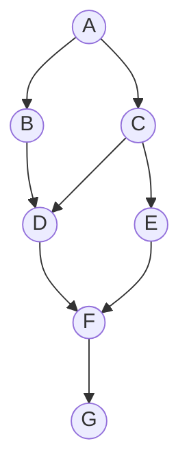
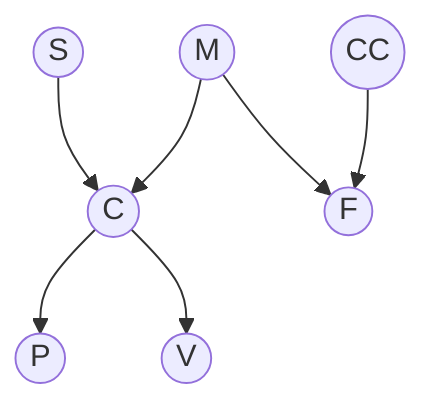
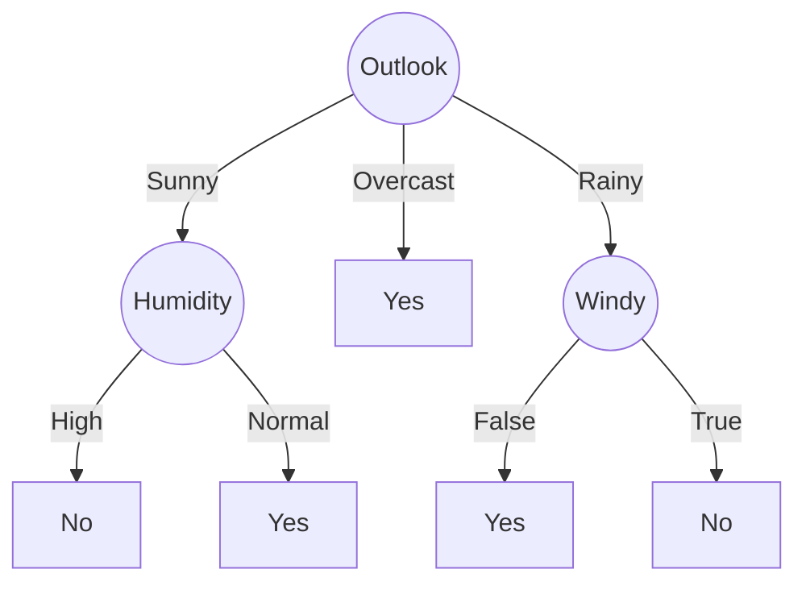
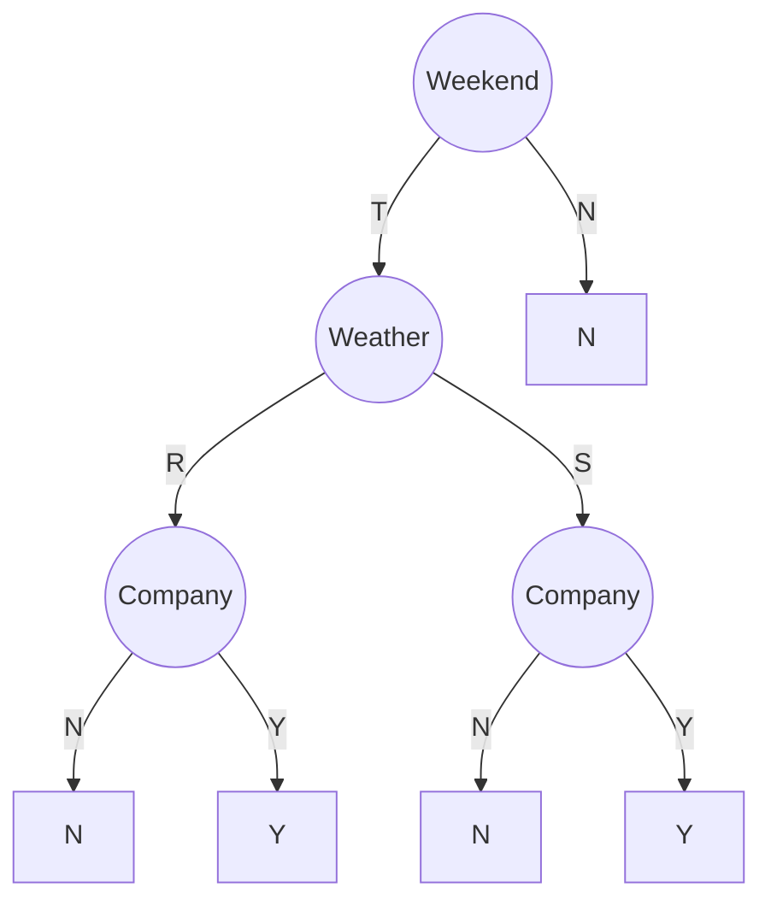
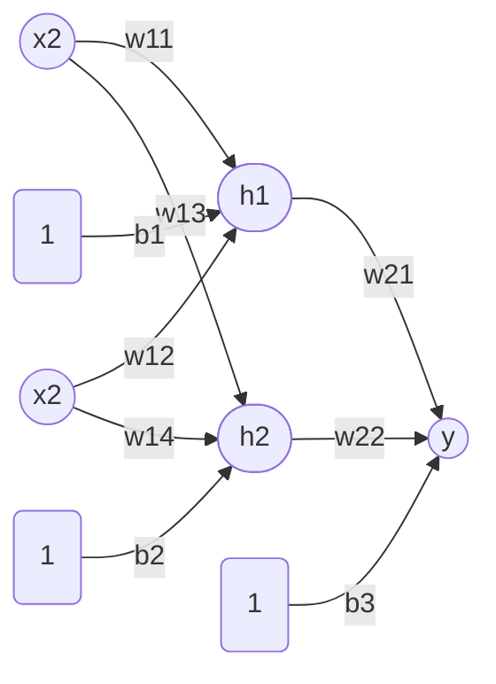
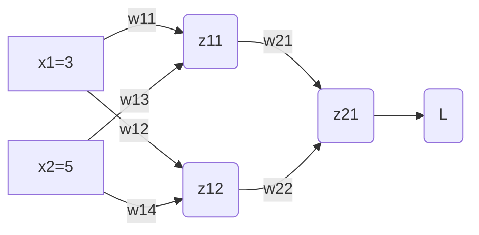
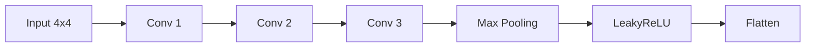
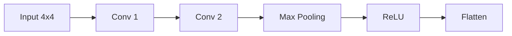

# 高级人工智能笔记

> [!NOTE]
>
> 作者：赤川鹤鸣_Channel | Author: AkagawaTsurunaki | All rights reserved.
>
> 本笔记适用于 2025 级《高级人工智能》考试，内容涵盖：贝叶斯网络、决策树、全连接网络、卷积神经网络和 Transformer 的相关笔记、真题和模拟题. 

## 贝叶斯网络

### 参数量计算

求该贝叶斯网络的参数量. 

列表，其中 $r_i$ 指的是这个节点可能的取值个数（一般是题目已知），$q_i$ 是其父节点可能的取值个数

| 节点 | $r_i$ | $q_i$           | 参数量 $(r_i-1)\times q_i$ | 说明                                                         |
| ---- | ----- | --------------- | -------------------------- | ------------------------------------------------------------ |
| $A$  | $3$   | $1$             | $2$                        | 没有父节点，只有 1 种可能                                    |
| $B$  | $2$   | $3$             | $3$                        | $B$ 的父节点是 $A$，把 $A$ 的可能取值个数 $r_1$ 抄到 $q_{2}$ |
| $C$  | $3$   | $3$             | $6$                        | $C$ 的父节点是 $A$，把 $A$ 的可能取值个数 $r_1$ 抄到 $q_{3}$ |
| $D$  | $3$   | $2\times 3=6$   | $12$                       | $D$ 的父节点是 $B, C$，把 $B, C$ 的可能取值个数 $r_2, r_3$ 相乘抄到 $q_{4}$ |
| $E$  | $2$   | $3$             | $3$                        | $E$ 的父节点是 $C$，把 $C$ 的可能取值个数 $r_3$ 抄到 $q_{5}$ |
| $F$  | $2$   | $2\times 3 = 6$ | $6$                        | $F$ 的父节点是 $D,E$，把 $D,E$ 的可能取值个数 $r_4, r_5$ 抄到 $q_{6}$ |
| $G$  | $3$   | $2$             | $4$                        | $G$ 的父节点是 $F$，把 $F$ 的可能取值个数 $r_6$ 抄到 $q_{7}$ |

最后按照参数量那列把数都加起来，即这个贝叶斯网络的参数量为
$$
N = 2+3+6+12+3+6+4=36
$$

### 独立性判断

如何证明 $A \perp\!\!\!\perp B \mid C$？

把贝叶斯网络图的箭头忽略，只留下线，看成无向图. 对于从 $A$ 到 $B$ 的其中的一条路径，若满足以下两个条件中的任意一条，则称这条路径是**阻塞** 的

1. 路径中存在某个节点 $X$ 是 head-to-tail 或者 tail-to-tail 节点，并且 $X$ 包含在条件集 $C$ 中；
2. 路径中存在某个节点 $X$ 是 head-to-head 节点，并且 $X$ 或其子节点不包含在条件集 $C$ 中；

如果从 $A$ 到 $B$ 的所有路径都是阻塞的，那么它们就是条件独立的；否则，它们就是非条件独立的. 

### 条件概率的计算

1. 先根据条件概率公式把原式改写为联合分布之商的形式；
2. 根据贝叶斯网络的结构写出联合概率的连乘式子；
3. 把分子的联合概率根据题里的数据算出来；
4. 按照全概率公式，针对非条件变量遍历所有可能的情况，把它做分母. 

**例题：**

判断： (1) $S \perp\!\!\!\perp V$；(2) $S \perp\!\!\!\perp M \mid C$；(3) $P \perp\!\!\!\perp V \mid C$. 

对于 $S \rightarrow C \rightarrow V$，$C$ 是 head-to-tail 节点，但 $C$ 不在条件集 $\varnothing$ 中，$C$ 不阻塞，所以 $S \perp\!\!\!\perp V$ 为 False.

对于 $S \rightarrow C \leftarrow M$，$C$ 是 head-to-head 节点，但 $C$ 在条件集 $\{C\}$ 中，$C$ 不阻塞，所以 $S \perp\!\!\!\perp M \mid C$ 为 False.

对于 $P \leftarrow C \rightarrow M$，$C$ 是 tail-to-tail 节点，$C$ 在条件集 $\{C\}$ 中，$C$ 阻塞，所以 $P \perp\!\!\!\perp V \mid C$ 为 True.

计算条件概率 $P(-m \mid +s, +c, +f, -cc, +v)$ 
$$
\begin{align*}
P(-m \mid +s, +c, +f, -cc, +v) &= \frac{P(-m, +s, +c, +f, -cc, +v)}{P(+s, +c, +f, -cc, +v)} \\
&= \frac{P(-m, +s, +c, +f, -cc, +v)}{P(-m, +s, +c, +f, -cc, +v) + P(+m, +s, +c, +f, -cc, +v)}
\end{align*}
$$

根据贝叶斯网络，有

$$
P(M, S, C, F, CC, V) = P(S) \cdot P(M) \cdot P(CC) \cdot P(C|S,M) \cdot P(F|CC,M) \cdot P(V|C,F)
$$

根据题意，有 $P(-m) = 0.2$，$P(+s) = 0.3$， $P(-cc) = 0.9$，$P(+c \mid +s, -m) = 0.8$，$P(+f \mid -cc, -m) = 0.1$，$P(+v \mid +c, +f) = 0.95$，所以

$$
P(-m, +s, +c, +f, -cc, +v) = 0.2 \times 0.3 \times 0.9 \times 0.8 \times 0.1 \times 0.95 = 0.004104
$$

根据题意，有 $P(+m) = 0.8$，$P(+s) = 0.3$，$P(-cc) = 0.9$，$P(+c \mid +s, +m) = 0.5$，$P(+f \mid -cc, +m) = 0.01$，$P(+v \mid +c, +f) = 0.95$，所以

$$
P(+m, +s, +c, +f, -cc, +v) = 0.8 \times 0.3 \times 0.9 \times 0.5 \times 0.01 \times 0.95 = 0.001026
$$

最后，可得

$$
P(-m \mid +s, +c, +f, -cc, +v) = \dfrac{0.004104}{0.004104 + 0.001026} = 0.8
$$

## 决策树

### 熵

$$
\mathrm{Entropy}(S) = -\sum_{i=1}^{K} p_i \log_2 p_i
$$

均匀分布时熵为 1，确定性取值（例如只有一个可能的取值）时熵为 0. 

### ID3 决策树

| Outlook  | Temperature | Humidity | Windy | Play |
| -------- | ----------- | -------- | ----- | ---- |
| Sunny    | Hot         | High     | False | No   |
| Sunny    | Hot         | High     | True  | No   |
| Overcast | Hot         | High     | False | Yes  |
| Rainy    | Mild        | High     | False | Yes  |
| Rainy    | Cool        | Normal   | False | Yes  |
| Rainy    | Cool        | Normal   | True  | No   |
| Overcast | Cool        | Normal   | True  | Yes  |
| Sunny    | Mild        | High     | False | No   |
| Sunny    | Cool        | Normal   | False | Yes  |
| Rainy    | Mild        | Normal   | False | Yes  |
| Sunny    | Mild        | Normal   | True  | Yes  |
| Overcast | Mild        | High     | True  | Yes  |
| Overcast | Hot         | Normal   | False | Yes  |
| Rainy    | Mild        | High     | True  | No   |

第一步，我们先计算出总熵，整个表格里有 5 个 No，9 个 Yes
$$
\mathrm{Entropy}(S) = -\frac{5}{14} \log_2 \frac{5}{14} -\frac{9}{14} \log_2 \frac{9}{14} = 0.940
$$
第二步，我们分别计算 Outlook、Temperature、Humidity、Windy 的熵. 

对于 Outlook，可能的取值是 Sunny、Overcast、Rainy，那么表格中 (1) 当 Outlook = Sunny 时，有 3 个 No，2 个 Yes；(2) 当 Outlook = Overcast 时，有 0 个 No，有 4 个 Yes；(3) 当 Outlook = Rain 时，有 2 个 No，有 3 个 Yes. 
$$
\mathrm{Entropy}(\text{Outlook}=\text{Sunny}) = -\frac{3}{5} \log_{2} \frac{3}{5} -\frac{2}{5} \log_{2} \frac{2}{5} = 0.971  \\
\mathrm{Entropy}(\text{Outlook}=\text{Overcast}) = -\frac{0}{4} \log_{2} \frac{0}{4} -\frac{4}{4} \log_{2} \frac{4}{4} = 0 \\
\mathrm{Entropy}(\text{Outlook}=\text{Sunny}) = -\frac{2}{5} \log_{2} \frac{2}{5} -\frac{3}{5} \log_{2} \frac{3}{5}  = 0.971
$$
进一步，我们求 Outlook 的加权求和熵
$$
\begin{align*}
\mathrm{Entropy}(\text{Outlook}) &= \dfrac{5}{14} \times \mathrm{Entropy}(\text{Outlook}=\text{Sunny}) + \dfrac{4}{14} \times \mathrm{Entropy}(\text{Outlook}=\text{Overcast}) + \dfrac{5}{14} \times \mathrm{Entropy}(\text{Outlook}=\text{Sunny}) \\
&= \dfrac{5}{14} \times  0.971  + \dfrac{4}{14} \times 0 + \dfrac{5}{14} \times 0.971 \\
&= 0.694
\end{align*}
$$
再对于 Temperature、Humidity、Windy 也和上面一样，即
$$
\mathrm{Entropy}(\text{Temperature}) = 0.911 \\
\mathrm{Entropy}(\text{Humidity}) = 0.789 \\
\mathrm{Entropy}(\text{Windy}) = 0.892
$$
最后算出信息增益
$$
\mathrm{Gain}(\text{Outlook}) = \mathrm{Entropy}(S) - \mathrm{Entropy}(\text{Outlook}) = 0.940-0.694=0.246 \\
\mathrm{Gain}(\text{Temperature}) = \mathrm{Entropy}(S) - \mathrm{Entropy}(\text{Temperature}) = 0.940-0.911=0.029 \\
\mathrm{Gain}(\text{Humidity}) = \mathrm{Entropy}(S) - \mathrm{Entropy}(\text{Humidity}) = 0.940-0.789=0.151 \\
\mathrm{Gain}(\text{Windy}) = \mathrm{Entropy}(S) - \mathrm{Entropy}(\text{Windy}) = 0.940-0.892=0.048
$$
这里最大的信息增益是来自于 Outlook，所以选择 **Outlook**. 

第三步，递归地求解剩余的属性，现在还剩 Temperature、Humidity、Windy 可以选择，这里需要注意，和第一步类似，我们也有算出总熵，但是是 Outlook 的熵，因为我们第二步选择了 Outlook. 然后接着计算信息增益，找出最大的那个信息增益，这里应该是 Humidity. 

第四步，同理，选出 Windy. 

最后完成了整个树的构建. 

**【2020-2021 真题】** 现有一些关于人们何时去购物的数据. 这些数据考虑了购物是否在周末、天气是否下雨或晴朗，以及购物时是否有人陪伴. 使用下面的训练数据找到购物习惯的决策树. 在每个节点分割决策树时，使用信息增益. （保留两位小数）

| Weekend | Company | Weather | Shopping |
| ------- | ------- | ------- | -------- |
| Y       | N       | R       | N        |
| Y       | Y       | R       | N        |
| Y       | Y       | R       | Y        |
| Y       | Y       | S       | Y        |
| Y       | N       | S       | Y        |
| Y       | N       | S       | N        |
| Y       | Y       | R       | N        |
| Y       | Y       | S       | Y        |
| N       | Y       | S       | N        |
| N       | Y       | R       | N        |
| N       | N       | S       | N        |

绘制你的决策树并写出计算过程. 

**解：**

求出总熵
$$
E(S) = -\frac{4}{11}\log\frac{4}{11} - \frac{7}{11}\log\frac{7}{11} = 0.96
$$

对于 Weekend，当 Weekend = Y 时：4Y，4N（Shopping 属性，下同）；Weekend = N 时：0Y，3N

$$
E(\text{Weekend}=Y) = -\frac{4}{8}\log\frac{4}{8} - \frac{4}{8}\log\frac{4}{8} = 1
\\
E(\text{Weekend}=N) = -\frac{3}{3}\log\frac{3}{3} = 0
\\
E(\text{Weekend}) = \frac{8}{11} \times E(\text{Weekend}=Y) + \frac{3}{11} \times E(\text{Weekend}=N) = \frac{8}{11} \times 1 + \frac{3}{11} \times 0 = 0.73
$$
对于 Company，Company = Y 时：3Y，4N；Company = N 时：1Y，3N  

$$
E(\text{Company}=Y) = -\frac{3}{7}\log\frac{3}{7} - \frac{4}{7}\log\frac{4}{7} = 0.99
\\
E(\text{Company}=N) = -\frac{1}{4}\log\frac{1}{4} - \frac{3}{4}\log\frac{3}{4} = 0.81
\\
E(\text{Company}) = \frac{7}{11}\times 0.99 + \frac{4}{11}\times 0.81 = 0.92
$$

对于 Weather，Weather = R 时：1Y，4N；Weather = S 时：3Y，3N  

$$
E(\text{Weather}=R) = -\frac{1}{5}\log\frac{1}{5} - \frac{4}{5}\log\frac{4}{5} = 0.72
\\
E(\text{Weather}=S) = -\frac{3}{6}\log\frac{3}{6} - \frac{3}{6}\log\frac{3}{6} = 1
\\
E(\text{Weather}) = \frac{5}{11}\times E(\text{Weather}=R) + \frac{6}{11}\times E(\text{Weather}=S) = \frac{5}{11}\times 0.72 + \frac{6}{11}\times 1 = 0.86
$$
信息增益

$$
\text{Gain}(\text{Weekend}) = E(S) - E(\text{Weekend}) = 0.95 - 0.73 = 0.72
\\
\text{Gain}(\text{Company}) = E(S) - E(\text{Company}) = 0.95 - 0.92 = 0.03
\\
\text{Gain}(\text{Weather}) = E(S) - E(\text{Weather}) = 0.95 - 0.86 = 0.09
$$
所以在第一层种选择信息增益最大的那个节点，即 Weekend. 

这样，Weekend 又有两种情况（Y 或 N），分别讨论：

在 Weekend = Y 条件下，对于 Company，Company = N 时：1Y，2N；Company = Y 时：3Y，2N
$$
E(\text{Company}=Y \mid \text{Weekend} = Y) = -\frac{3}{5}\log\frac{3}{5} - \frac{2}{5}\log\frac{2}{5} = 0.97
\\
E(\text{Company}=N\mid \text{Weekend} = Y) = -\frac{1}{3}\log\frac{1}{3} - \frac{2}{3}\log\frac{2}{3} = 0.92
\\
\begin{align*}
E(\text{Company}\mid \text{Weekend} = Y) 
&= \frac{5}{8}\times E(\text{Company}=Y \mid \text{Weekend} = Y) + \frac{3}{8} \times E(\text{Company}=N\mid \text{Weekend} = Y)\\
&= \frac{5}{8}\times 0.97 + \frac{3}{8}\times 0.92  \\
&= 0.95
\end{align*}
$$
在 Weekend = Y 条件下，对于 Weather，Weather = R 时：1Y，3N；Weather = R 时：3Y，1N
$$
E(\text{Weather}=R \mid \text{Weekend} = Y) = -\frac{1}{4}\log\frac{1}{4} - \frac{3}{4}\log\frac{3}{4} = 0.81
\\
E(\text{Weather}=S \mid \text{Weekend} = Y) = -\frac{3}{4}\log\frac{3}{4} - \frac{1}{4}\log\frac{1}{4} = 0.81
\\
\begin{align*}
E(\text{Weather}\mid \text{Weekend} = Y ) &= \frac{4}{8}\times E(\text{Weather}=R \mid \text{Weekend} = Y) + \frac{4}{8}\times E(\text{Weather}=S\mid \text{Weekend} = Y ) \\
&= \frac{4}{8}\times 0.81 + \frac{4}{8}\times 0.81 \\
&= 0.81
\end{align*}
$$
在 Weekend = Y 条件下，有 $E(S') = E(\text{Weekend} = Y) = 1$，计算信息增益
$$
\text{Gain}(\text{Company}\mid \text{Weekend}=Y)
= E(S') - E(\text{Company}\mid \text{Weekend}=Y)
= 1 - 0.95
= 0.05 \\
\text{Gain}(\text{Weather}\mid \text{Weekend}=Y)
= E(S') - E(\text{Weather}\mid \text{Weekend}=Y)
= 1 - 0.81
= 0.19
$$

所以在第二层，在 Weekend = Y 条件下，选择信息增益最大的那个节点，即 $\text{Weather}\mid \text{Weekend}=Y$. 

我们要讨论第二种情况，即在 Weekend = N 条件下，不过注意到此时所有样本都是 N，所以无需再做选择，此时信息增益已经达到最大. 

到此为止，Weekend 和 Weather 都已经被选择，只剩下 Company，然后只需要按照之后的 $\text{Company} \mid \text{Weather}=S, \text{Weekend} = Y $ 和 $$\text{Company} \mid \text{Weather}=R, \text{Weekend} = Y $$ 中的样本直接做决策就好（例如如果某个条件下 N 比 Y 多，那么这个条件下直接决策为 N 即可，无需再计算）. 

综上所述，得到了决策树

### C4.5 决策树

与上面的类似，但是利用增益率来计算，以 Outlook 为例，可能的取值是 Sunny、Overcast、Rainy. 
$$
\mathrm{InitInfo}(\text{Outlook}) = -\frac{5}{14} \log_2 \frac{5}{14} -\frac{4}{14} \log_2 \frac{4}{14} = 1.577 \\
\mathrm{GainRatio}(\text{Outlook}) = \frac{\mathrm{Gain}(\text{Outlook})}{\mathrm{InitInfo}(\text{Outlook})} = \frac{0.246}{1.577} = 0.156
$$
然后也是找最大的增益率即可. 

## 全连接网络

> [!TIP]
>
> 全连接网络的考点是前向传播与反向传播. 

**【2021-2022 真题】** 如图是一个全连接网络. 初始时，所有权重设为0.5. 本轮的训练样本为 $[(x_1, x_2, 1), \hat{y}] = [(3, 4, 1), 0.5]$. 损失函数为 $L = \frac{1}{2}(y - \hat{y})^2$，其中 $\hat{y}$ 是期望输出. 所有隐藏层和输出层必须通过激活函数激活. 激活函数是 Sigmoid ($σ$)，学习率 $\alpha$ 等于 $0.8$. （请保留结果的小数点后 4 位）

1. 计算模型的最终损失 $L$；
2. 计算更新后的 $w_{21}$ 和 $w_{11}$ 的值. 

**解：**

**1.** 根据全连接网络的结构，我们先计算 $h_1$
$$
u_1 = w_{11} x_1 + w_{12} x_2 + b_1 = 0.5 \times 3 + 0.5 \times 4 + 0.5 = 4\\
h_1 = \sigma(u_1) = \dfrac{1}{1+e^{-u_1}} = \dfrac{1}{1+e^{-4}} = 0.9820
$$
然后计算 $h_2$
$$
u_2 = w_{13} x_1 + w_{14} x_2 + b_2 = 0.5 \times 3 + 0.5 \times 4 + 0.5 = 4 \\
h_2 = \sigma(u_2) =\dfrac{1}{1+e^{-u_2}} = \dfrac{1}{1+e^{-4}} = 0.9820
$$
接着，计算 $y$
$$
u_3 = w_{21} h_1 + w_{22} h_2 + b_3 = 0.5 \times 0.9820+ 0.5 \times 0.9820 + 0.5 = 1.4820 \\
y = \sigma(u_3) =\dfrac{1}{1+e^{-u_3}} = \dfrac{1}{1+e^{-1.4820}} = 0.8149
$$
最后计算损失
$$
L = \frac{1}{2} (y - \hat{y})^2 = \frac{1}{2} (0.8149 - 0.5)^2 = 0.0496
$$
**2.** 计算更新后的权重，首先需要计算它们的梯度
$$
\frac{\partial L}{\partial w_{21}} = \frac{\partial}{\partial w_{21}} \frac{1}{2} (y - \hat{y})^2 = (y - \hat{y}) \frac{\partial y}{\partial w_{21}} \\
\frac{\partial y}{\partial w_{21}} = \frac{\partial \sigma(u_3)}{\partial w_{21}} = \sigma(u_3)\left(1-\sigma(u_3) \right) \frac{\partial u_3}{\partial w_{21}} \\
\frac{\partial u_3}{\partial w_{21}} = \frac{\partial }{\partial w_{21}} (w_{21} h_1 + w_{22} h_2 + b_3) = h_1 \\
$$
所以，
$$
\frac{\partial L}{\partial w_{21}} = (y - \hat{y}) \sigma(u_3)\left(1-\sigma(u_3) \right) h_1 = (0.8149 - 0.5) \times 0.8149 \times (1-0.8149) \times 0.9820 = 0.0466
$$
同理，我们也能算出
$$
\frac{\partial L}{\partial w_{11}} = \frac{\partial}{\partial w_{11}} \frac{1}{2} (y - \hat{y})^2 = (y - \hat{y}) \frac{\partial y}{\partial w_{11}} \\
\frac{\partial y}{\partial w_{11}} = \frac{\partial \sigma(u_3)}{\partial w_{11}} = \sigma(u_3)\left(1-\sigma(u_3) \right) \frac{\partial u_3}{\partial w_{11}} \\
\frac{\partial u_3}{\partial w_{11}} = \frac{\partial }{\partial w_{11}} (w_{21} h_1 + w_{22} h_2 + b_3) = w_{21} \frac{\partial h_1 }{\partial w_{11}} \\
\frac{\partial h_1 }{\partial w_{11}} = \sigma(u_1) \left(1-  \sigma(u_1) \right) \frac{\partial u_1 }{\partial w_{11}} \\
\frac{\partial u_1 }{\partial w_{11}} = \frac{\partial }{\partial w_{11}}(w_{11} x_1 + w_{12} x_2 + b_1) =  x_1
$$
所以，
$$
\begin{align*}
\frac{\partial L}{\partial w_{11}} &= (y - \hat{y})  \sigma(u_3)\left(1-\sigma(u_3) \right) w_{21} \sigma(u_1) \left(1-  \sigma(u_1) \right) x_1 \\
&= (0.8149 - 0.5) \times 0.8149 \times (1-0.8149) \times 0.5 \times 0.9820 \times (1-0.9820) \times 3 \\
&= 0.0013
\end{align*}
$$
因此，更新后的参数为
$$
w_{21} - \alpha \frac{\partial L}{\partial w_{21}} = 0.5 - 0.8 \times 0.0466 = 0.4627 \\
w_{11} - \alpha \frac{\partial L}{\partial w_{11}} = 0.5 - 0.8 \times 0.0013 = 0.4990
$$

**【2020-2021 真题】** 初始时，所有权值均为 0.5. 输入为 $[3, 5, 0]$. 损失函数为 $L = \frac{1}{2}(y - \hat{y})^2$ 其中 $\hat{y}$ 为期望输出；激活函数为 Sigmoid（$σ$）；学习率 $\alpha = 0.1$. 网络结构如下：（保留 2 位小数）

**解：**

**(1)** 先分别从第一层计算 $z_{11}$ 和 $z_{12}$
$$
z_{11} = w_{11}  x_1 + w_{12} x_2 = 0.5 \times 3 + 0.5 \times 5 = 4 \\
z_{12} = w_{13} x_1 + w_{14}  x_2 = 0.5 \times 3 + 0.5 \times 5 = 4
$$

接下来经过激活函数计算出 $a_{11}$ 和 $a_{12}$

$$
a_{11} = \sigma(z_{11}) = \frac{1}{1 + e^{-0.65}} = 0.98 \\
a_{12} = \sigma(z_{12}) = \frac{1}{1 + e^{-0.65}} = 0.98
$$

进而算第二层的 $z_{21}$

$$
z_{21} = w_{21} a_{11} + w_{22} a_{12} = 0.5 \times 0.98 + 0.5 \times 0.98 = 0.98
$$

然后，同样经过激活函数计算出 $a_{21}$

$$
a_{21} = \sigma(z_{21}) = \frac{1}{1 + e^{-0.98}} = 0.73
$$

最后，计算损失

$$
L = \frac{1}{2}(y - \hat{y})^2 = \frac{1}{2}(0.73 - 0)^2 = 0.27
$$

**(2)** 首先，对于参数 $w_{21}$ 求出
$$
\frac{\partial L}{\partial w_{21}} = (y - \hat{y})  \frac{\partial y}{\partial w_{21}} \\
\frac{\partial y}{\partial w_{21}} =\sigma(z_{21}) (1 - \sigma(z_{21}))  \frac{\partial z_{21}}{\partial w_{21}} \\
\frac{\partial z_{21}}{\partial w_{21}} = \frac{\partial}{\partial w_{21}} (w_{21} a_{11} + w_{22} a_{12}) = a_{11}
$$

然后代入数据得
$$
\frac{\partial L}{\partial w_{21}} = (y - \hat{y}) \cdot \sigma(z_{21}) (1 - \sigma(z_{21})) \cdot a_{11} = (0.73 - 0) \times 0.73 \times (1 - 0.73) \times 0.98 = 0.14
$$
对于参数 $w_{11}$，求出
$$
\frac{\partial L}{\partial w_{11}} = (y - \hat{y}) \frac{\partial y}{\partial w_{11}} \\
\frac{\partial y}{\partial w_{11}} = \sigma(z_{21})  (1 - \sigma(z_{21})) \frac{\partial z_{21}}{\partial w_{11}} \\
\frac{\partial z_{21}}{\partial w_{11}} = w_{21} \frac{\partial a_{11}}{\partial w_{11}} \\
\frac{\partial a_{11}}{\partial w_{11}} = \sigma(z_{11})  (1 - \sigma(z_{11}))  \frac{\partial z_{11}}{\partial w_{11}} \\
\frac{\partial z_{11}}{\partial w_{11}} = \frac{\partial }{\partial w_{11}} (w_{11}  x_1 + w_{12} x_2) = x_1
$$
然后代入数据得
$$
\begin{align*}
\frac{\partial L}{\partial w_{11}} &= (y - \hat{y}) \cdot \sigma(z_{21})  (1 - \sigma(z_{21})) \cdot w_{21} \cdot \sigma(z_{11})  (1 - \sigma(z_{11})) \cdot x_1 \\
&= (0.73 - 0) \times 0.73 \times (1 - 0.73) \times 0.5 \times 0.98 \times (1 - 0.98) \times 3 \\
&=0.00423 \approx 0
\end{align*}
$$
最后得到参数更新值

$$
w_{21} - \alpha \frac{\partial L}{\partial w_{21}} = 0.5 - 0.1 \times 0.14 = 0.486 \approx 0.49
\\
w_{11} - \alpha \frac{\partial L}{\partial w_{11}} = 0.5 - 0.1 \times 0.00423 \approx 0.5
$$

## 卷积神经网络

**【2021-2022 真题】** 在CNN（卷积神经网络）的前向传播过程中，网络模型及其输入如下. （注意：使用 0 padding）

给定的输入矩阵为 $ \begin{bmatrix} 5 & 2 & 0 & 1 \\ 2 & 6 & 0 & 2 \\ 1 & -1 & 5 & -3 \\ 0 & 3 & -2 & 0 \end{bmatrix} $，$\mathrm{LeakyReLU}(x) = \begin{cases} x, &  x > 0 \\ 0.01x, &  x \leq 0 \end{cases}$.

| 层（layer） | 卷积核数量 | 卷积核（kernel）                                             | 步长（stride） | 填充（padding） |
| ----------- | ---------- | ------------------------------------------------------------ | -------------- | --------------- |
| Conv1       | 1          | $\begin{bmatrix} 2 \end{bmatrix}$                            | 1              | 0               |
| Conv2       | 2          | $\begin{bmatrix} 1 & 0 \\ 2 & 1 \end{bmatrix}, \begin{bmatrix} 1 & 1 \\ 0&2 \end{bmatrix}$ （对于每个输入） | 1              | 0               |
| Conv3       | 1          | $\left( \begin{bmatrix} 3 & 0 \\ -1 & 2 \end{bmatrix}, \begin{bmatrix} 2 & 0 \\ -2 & 1 \end{bmatrix} \right)$ （对于每个通道） | 1              | 1               |
| Max Pooling | 1          | 核大小为 $2\times 2$                                         | 2              | 0               |

1. 写出经过 `Conv2` 后的特征图；
2. 写出经过 `LeakyReLU` 激活后的输出；
3. Softmax 函数为 $ F(x_i) = \dfrac{e^{x_i}}{\sum_{i=1}^{n} e^{x_i}} $，损失函数是 Softmax 交叉熵损失 $E(t, y) = -\sum_{j=1}^{n} t_j \log(y_j) $，期望输出（标签）是 $(1,0,0,0)$，请计算给定输入的损失. （需要计算过程）

**解：**

**1.** 在 Input → Conv1 时，因为卷积核仅为一个标量，相当于矩阵数乘，所以 Conv1 的输出是
$$
2 \begin{bmatrix} 5 & 2 & 0 & 1 \\ 2 & 6 & 0 & 2 \\ 1 & -1 & 5 & -3 \\ 0 & 3 & -2 & 0 \end{bmatrix} = 
 \begin{bmatrix} 10 & 4 & 0 & 2 \\ 4 & 12 & 0 & 4 \\ 2 & -2 & 10 & -6 \\ 0 & 6 & -4 & 0 \end{bmatrix}
$$
Conv2 有两个卷积核，先算第一个 $\begin{bmatrix} 1 & 0 \\ 2 & 1 \end{bmatrix}$，由于没有填充，步长为1，即

对于 Conv1 的输出的第一行做卷积有

$$
\begin{bmatrix}
10 & 4 \\
4 & 12
\end{bmatrix}
\odot
\begin{bmatrix}
1 & 0 \\
2 & 1
\end{bmatrix}
=10\cdot1+4\cdot0+4\cdot2+12\cdot1=30
$$

$$
\begin{bmatrix}
4 & 0 \\
12 & 0
\end{bmatrix}
\odot
\begin{bmatrix}
1 & 0 \\
2 & 1
\end{bmatrix}
=4\cdot1+0\cdot0+12\cdot2+0\cdot1=28\\
$$

$$
\begin{bmatrix}
0 & 2 \\
0 & 4
\end{bmatrix}
\odot
\begin{bmatrix}
1 & 0 \\
2 & 1
\end{bmatrix}
=0\cdot1+2\cdot0+0\cdot2+4\cdot1=4
$$

这样 Conv2 的输出（对于此卷积核）的第 1 行元素就分别是，30，28，4. 

接着同理在第二行有

$$
\begin{bmatrix}
4 & 12 \\
2 & -2
\end{bmatrix}
\odot
\begin{bmatrix}
1 & 0 \\
2 & 1
\end{bmatrix}
=4\cdot1+12\cdot0+2\cdot2+(-2)\cdot1=6
$$

$$
\begin{bmatrix}
12 & 0 \\
-2 & 10
\end{bmatrix}
\odot
\begin{bmatrix}
1 & 0 \\
2 & 1
\end{bmatrix}
=12\cdot1+0\cdot0+(-2)\cdot2+10\cdot1=18
$$

$$
\begin{bmatrix}
0 & 4 \\
10 & -6
\end{bmatrix}
\odot
\begin{bmatrix}
1 & 0 \\
2 & 1
\end{bmatrix}
=0\cdot1+4\cdot0+10\cdot2+(-6)\cdot1=14
$$

这样 Conv2 的输出（对于此卷积核）的第 2 行元素就分别是，6，18，14. 

$$
\begin{bmatrix}
2 & -2 \\
0 & 6
\end{bmatrix}
\odot
\begin{bmatrix}
1 & 0 \\
2 & 1
\end{bmatrix}
=2\cdot1+(-2)\cdot0+0\cdot2+6\cdot1=8
$$

$$
\begin{bmatrix}
-2 & 10 \\
6 & -4
\end{bmatrix}
\odot
\begin{bmatrix}
1 & 0 \\
2 & 1
\end{bmatrix}
=-2\cdot1+10\cdot0+6\cdot2+(-4)\cdot1=6
$$

$$
\begin{bmatrix}
10 & -6 \\
-4 & 0
\end{bmatrix}
\odot
\begin{bmatrix}
1 & 0 \\
2 & 1
\end{bmatrix}
=10\cdot1+(-6)\cdot0+(-4)\cdot2+0\cdot1=2
$$

这样 Conv2 的输出（对于此卷积核）的第 3 行元素就分别是，8，6，2. 

因此对于此卷积核来说，Conv2 的输出特征图为

$$
\begin{bmatrix}
30 & 28 & 4 \\
6 & 18 & 14 \\
8 & 6 & 2
\end{bmatrix}
$$

同理，可以计算在卷积核 $\begin{bmatrix} 1 & 1 \\ 0&2 \end{bmatrix}$ 下，Conv2 的输出特征图为
$$
\begin{bmatrix}
38 & 4 & 10 \\
12 & 32 & -8 \\
12 & 0 & 4
\end{bmatrix}
$$
**2.** 接着计算到 Conv3，注意到 Conv3 只有 1 个卷积核，把 $\left( \begin{bmatrix} 3 & 0 \\ -1 & 2 \end{bmatrix}, \begin{bmatrix} 2 & 0 \\ -2 & 1 \end{bmatrix} \right)$ 视为一个整体，从而对 Conv2 的输出特征图（2个，即 2 个通道）合并为 1 个. 

还要注意，Conv3 含有 padding 1，所以上一题的输出要加 1 圈 padding，即
$$
\begin{bmatrix}
0 & 0 &0 &0 &0 \\
0 &30 & 28 & 4&0 \\
0 &6 & 18 & 14&0 \\
0 & 8 & 6 & 2&0 \\
0 & 0 &0 &0 &0
\end{bmatrix} \quad 
\begin{bmatrix}
0 & 0 &0 &0 &0 \\
0 &38 & 4 & 10 &0\\
0 &12 & 32 & -8 &0\\
0 &12 & 0 & 4&0 \\
0 & 0 &0 &0 &0
\end{bmatrix}
$$
这样 Conv3 输出的第 1 行第 1 个元素就是
$$
\begin{bmatrix}
0 & 0 \\
0 & 30 \\
\end{bmatrix} \odot 
\begin{bmatrix} 3 & 0 \\ -1 & 2 \end{bmatrix} +
\begin{bmatrix}
0 & 0 \\
0 & 38 \\
\end{bmatrix} \odot
\begin{bmatrix} 2 & 0 \\ -2 & 1 \end{bmatrix}
= 98
$$

> [!TIP]
>
> 易错点：这与 Conv2 可不一样，因为 Conv2 是两个卷积核，作用是分离特征，但是Conv3 是 1 个卷积核，作用是合并特征. 

同理，第 1 行第 2 个元素就是

$$
\begin{bmatrix}
0 & 0 \\
30 & 28 \\
\end{bmatrix} \odot 
\begin{bmatrix} 3 & 0 \\ -1 & 2 \end{bmatrix} +
\begin{bmatrix}
0 & 0 \\
38 & 4 \\
\end{bmatrix} \odot
\begin{bmatrix} 2 & 0 \\ -2 & 1 \end{bmatrix}
= -46
$$

剩下的就不再赘述，和之前算卷积的流程一样，这里直接给出答案

$$
\begin{bmatrix}
98 & -46 & -18 & -24 \\
24 & 204 & 30 & 34 \\
28 & 22 & 120 & 16 \\
0 & 48 & 18 & 14
\end{bmatrix}
$$

然后，是 Max pooling 最大池化层，这里的操作和卷积很像，不过不是乘积求和，而是找到 $2 \times 2$ 范围内最大的那个，例如

$$
\max \begin{bmatrix}
98 & -46 \\
24 & 204 \\
\end{bmatrix} = 204
$$

这里需要注意，最大池化层的设置为步长 2，所以从左到右跳 2 格，那么下一个元素应该是

$$
\max \begin{bmatrix}
-18 & -24 \\
30 & 34 \\
\end{bmatrix} = 34
$$

下一行也要跳两格，也就是

$$
\max \begin{bmatrix}
28 & 22 \\
0 & 48 \\
\end{bmatrix} = 48 
,\quad 
\max \begin{bmatrix}
120 & 16 \\
18 & 14 \\
\end{bmatrix} = 120 
$$

这样就得到了最大池化层的输出

$$
\begin{bmatrix}
204 & 34 \\
48 & 120 \\
\end{bmatrix}
$$

后面紧跟着一个非线性激活函数 LeakyReLU，即

$$
\begin{bmatrix}
\mathrm{LeakyReLU}(204) & \mathrm{LeakyReLU}(34) \\
\mathrm{LeakyReLU}(48) & \mathrm{LeakyReLU}(120) \\
\end{bmatrix}
 =
 \begin{bmatrix}
204 & 34 \\
48 & 120 \\
\end{bmatrix}
$$

**3.** 根据 (2) 的结果，把它展平后得到 $(204, 34, 48, 120 )$. 

经过 Softmax 函数后，得到的结果是（浮点误差截断，因为指数激增）
$$
\left( \frac{e^{204}}{e^{204} + e^{34} + e^{48} + e^{120}}, \frac{e^{34}}{e^{204} + e^{34} + e^{48} + e^{120}},
\frac{e^{48}}{e^{204} + e^{34} + e^{48} + e^{120}}, \frac{e^{120}}{e^{204} + e^{34} + e^{48} + e^{120}}
\right) = (1, 0, 0, 0)
$$
交叉熵损失函数为
$$
E(t, y) = -\sum_{j=1}^{n} t_j \log(y_j) = - 1 \times \log1 + 0 \log 0+ 0 \log 0+ 0 \log 0 = 0
$$

**【2020-2021 真题】** 在CNN的前向传播过程中，该网络的输入和结构如下. （保留两位小数）

给定的输入矩阵为 $ \begin{bmatrix} 1 & 2 & 1 & 1 \\ 0 & 1 & 0 & 2 \\ 1 & -1 & -2 & 1 \\ 0 & 1 & 0 & 1 \end{bmatrix} $，$\mathrm{ReLU}(x) = \max (0, x)$.

| 层（layer） | 卷积核数量 | 卷积核（kernel）                                             | 步长（stride） | 填充（padding） |
| ----------- | ---------- | ------------------------------------------------------------ | -------------- | --------------- |
| Conv1       | 2          | $\begin{bmatrix} 1 & 2 \\ 0 & 1 \end{bmatrix}, \begin{bmatrix} 1 & 0 \\ 2&1 \end{bmatrix}$ （对于每个输入） | 1              | 0               |
| Conv2       | 1          | $\left( \begin{bmatrix} 3 & 0 \\ -2 & 0 \end{bmatrix}, \begin{bmatrix} -3 & 0 \\ 0 & 1 \end{bmatrix} \right)$ （对于每个通道） | 1              | 1               |
| Max Pooling | 1          | 核大小为 $2\times 2$                                         | 2              | 0               |

1. 写出经过 `Conv1` 后的特征图；
2. 写出经过 `ReLU` 激活后的输出；
3. Softmax 函数为 $ F(x_i) = \dfrac{e^{x_i}}{\sum_{i=1}^{n} e^{x_i}} $，损失函数是 Softmax 交叉熵损失 $E(t, y) = -\sum_{j=1}^{n} t_j \log(y_j) $，期望输出（标签）是 $(1,0,0,0)$，请计算给定输入的损失. （需要计算过程）

**解：**

**1.** 在 Input → Conv1 时，Conv1 有两个卷积核，先算第一个 $\begin{bmatrix} 1 & 2 \\ 0 & 1 \end{bmatrix}$，由于没有填充，步长为1，即

对于 Input 的第一行做卷积有

$$
\begin{bmatrix}
1 & 2 \\
0 & 1
\end{bmatrix}
\odot
\begin{bmatrix}
1 & 2 \\
0 & 1
\end{bmatrix}
=1\cdot1+2\cdot2+0\cdot0+1\cdot1=6
$$

$$
\begin{bmatrix}
2 & 1 \\
1 & 0
\end{bmatrix}
\odot
\begin{bmatrix}
1 & 2 \\
0 & 1
\end{bmatrix}
=2\cdot1+1\cdot2+1\cdot0+0\cdot1=4\\
$$

$$
\begin{bmatrix}
1 & 1 \\
0 & 2
\end{bmatrix}
\odot
\begin{bmatrix}
1 & 2 \\
0 & 1
\end{bmatrix}
=1\cdot1+1\cdot2+0\cdot0+2\cdot1=5
$$

这样 Conv1 的输出（对于此卷积核）的第 1 行元素就分别是，6，4，5. 

接着同理在第二行有

$$
\begin{bmatrix}
0 & 1 \\
1 & -1
\end{bmatrix}
\odot
\begin{bmatrix}
1 & 2 \\
0 & 1
\end{bmatrix}
=0\cdot1+1\cdot2+1\cdot0+(-1)\cdot1=1
$$

$$
\begin{bmatrix}
1 & 0 \\
-1 & -2
\end{bmatrix}
\odot
\begin{bmatrix}
1 & 2 \\
0 & 1
\end{bmatrix}
=1\cdot1+0\cdot2+(-1)\cdot0+(-2)\cdot1=-1
$$

$$
\begin{bmatrix}
0 & 2 \\
-2 & 1
\end{bmatrix}
\odot
\begin{bmatrix}
1 & 2 \\
0 & 1
\end{bmatrix}
=0\cdot1+2\cdot2+(-2)\cdot0+1\cdot1=5
$$

这样 Conv1 的输出（对于此卷积核）的第 2 行元素就分别是，1，-1，5. 
$$
\begin{bmatrix}
1 & -1 \\
0 & 1
\end{bmatrix}
\odot
\begin{bmatrix}
1 & 2 \\
0 & 1
\end{bmatrix}
=1\cdot1+(-1)\cdot2+0\cdot0+1\cdot1=0
$$

$$
\begin{bmatrix}
-1 & -2 \\
1 & 0
\end{bmatrix}
\odot
\begin{bmatrix}
1 & 2 \\
0 & 1
\end{bmatrix}
=-1\cdot1+(-2)\cdot2+1\cdot0+0\cdot1=-5
$$

$$
\begin{bmatrix}
-2 & 1 \\
0 & 1
\end{bmatrix}
\odot
\begin{bmatrix}
1 & 2 \\
0 & 1
\end{bmatrix}
=-2\cdot1+1\cdot2+0\cdot0+1\cdot1=1
$$

这样 Conv1 的输出（对于此卷积核）的第 3 行元素就分别是，0，-5，1. 

因此对于此卷积核来说，Conv1 的输出特征图为

$$
\begin{bmatrix}
6 & 4 & 5 \\
1 & -1 & 5 \\
0 & -5 & 1
\end{bmatrix}
$$
同理，可以计算在卷积核 $\begin{bmatrix} 1 & 0 \\ 2&1 \end{bmatrix}$ 下，Conv1 的输出特征图为
$$
\begin{bmatrix}
2 & 4 & 3 \\
1 & -3 & -3 \\
2 & 1 & -1
\end{bmatrix}
$$

**2.** 接着计算到 Conv2，注意到 Conv2 只有 1 个卷积核，把 $\left( \begin{bmatrix} 3 & 0 \\ -2 & 0 \end{bmatrix}, \begin{bmatrix} -3 & 0 \\ 0 & 1 \end{bmatrix} \right)$ 视为一个整体，从而对 Conv1 的输出特征图（2个，即 2 个通道）合并为 1 个. 

还要注意，Conv2 含有 padding 1，所以上一题的输出要加 1 圈 padding，即
$$
\begin{bmatrix}
0 & 0 & 0 & 0 & 0 \\
0 & 6 & 4 & 5 & 0 \\
0 & 1 & -1 & 5 & 0 \\
0 & 0 & -5 & 1 & 0 \\
0 & 0 & 0 & 0 & 0
\end{bmatrix} \quad
\begin{bmatrix}
0 & 0 & 0 & 0 & 0 \\
0 & 2 & 4 & 3 & 0 \\
0 & 1 & -3 & -3 & 0 \\
0 & 2 & 1 & -1 & 0 \\
0 & 0 & 0 & 0 & 0
\end{bmatrix}
$$

这样 Conv2 输出的第 1 行第 1 个元素就是

$$
\begin{bmatrix}
0 & 0 \\
0 & 6 \\
\end{bmatrix} \odot
\begin{bmatrix} 3 & 0 \\ -2 & 0 \end{bmatrix} +
\begin{bmatrix}
0 & 0 \\
0 & 2 \\
\end{bmatrix} \odot
\begin{bmatrix} -3 & 0 \\ 0 & 1 \end{bmatrix}
= 0+2=2
$$

同理，第 1 行第 2 个元素就是
$$
\begin{bmatrix}
0 & 0 \\
6 & 4 \\
\end{bmatrix} \odot
\begin{bmatrix} 3 & 0 \\ -2 & 0 \end{bmatrix} +
\begin{bmatrix}
0 & 0 \\
2 & 4 \\
\end{bmatrix} \odot
\begin{bmatrix} -3 & 0 \\ 0 & 1 \end{bmatrix}
= -12  + 4= 8
$$

剩下的就不再赘述，和之前算卷积的流程一样，这里直接给出答案
$$
\begin{bmatrix}
2 & -8 & -5 & -10 \\
1 & 7 & -1 & -4 \\
2 & 1 & 15 & 22 \\
0 & -6 & -18 & 6
\end{bmatrix}
$$
然后，是 Max pooling 最大池化层，这里的操作和卷积很像，不过不是乘积求和，而是找到 $2 \times 2$ 范围内最大的那个，例如

$$
\max \begin{bmatrix}
2 & -8 \\
1 & 7 \\
\end{bmatrix} = 7
$$
这里需要注意，最大池化层的设置为步长 2，所以从左到右跳 2 格，那么下一个元素应该是
$$
\max \begin{bmatrix}
-5 & -10 \\
-1 & -4 \\
\end{bmatrix} = -1
$$
下一行也要跳两格，也就是

$$
\max \begin{bmatrix}
2 & 1 \\
0 & -6 \\
\end{bmatrix} = 2
,\quad
\max \begin{bmatrix}
15 & 22 \\
-18 & 6 \\
\end{bmatrix} = 22
$$
这样就得到了最大池化层的输出

$$
\begin{bmatrix}
7 & -1 \\
2 & 22 \\
\end{bmatrix}
$$

后面紧跟着一个非线性激活函数 ReLU，即

$$
\begin{bmatrix}
\mathrm{ReLU}(7) & \mathrm{ReLU}(-1) \\
\mathrm{ReLU}(2) & \mathrm{ReLU}(22) \\
\end{bmatrix}
=
\begin{bmatrix}
7 & 0 \\
2 & 22 \\
\end{bmatrix}
$$
**3.** 根据 (2) 的结果，把它展平后得到 $(7, 0, 2, 22)$。

经过 Softmax 函数后，得到的结果是（注意精度保持）

$$
\left( \frac{e^{7}}{e^{7} + e^{0} + e^{2} + e^{22}}, \frac{e^{0}}{e^{7} + e^{0} + e^{2} + e^{22}},
\frac{e^{2}}{e^{7} + e^{0} + e^{2} + e^{22}}, \frac{e^{22}}{e^{7} + e^{0} + e^{2} + e^{22}}
\right) = (3.06\times 10^{-7}, 2.79\times 10^{-10}, 2.06\times 10^{-9}, 1)
$$

交叉熵损失函数为

$$
E(t, y) = -\sum_{j=1}^{n} t_j \log(y_j) = - 1 \times \log(3.06\times 10^{-7}) + 0 \log(2.79\times 10^{-10})+ 0 \log (2.06\times 10^{-9})+ 0 \log 1 = -15.00
$$

## Transformer

### 自注意力机制计算

【模拟题 I】已知权重矩阵

$$
\boldsymbol{W}^{q} =
\begin{bmatrix}
0.1 & 0.3 & 0.7 \\
0.5 & 0.3 & 0.2 \\
0.2 & 0.6 & 0.4
\end{bmatrix}
\quad
\boldsymbol{W}^{k} =
\begin{bmatrix}
0.7 & 0.2 & 0.5 \\
0.2 & 0.3 & 0.1 \\
0.4 & 0.6 & 0.1
\end{bmatrix}
\quad
\boldsymbol{W}^{v} =
\begin{bmatrix}
0.1 & 0.2 & 0.4 \\
0.3 & 0.7 & 0.2 \\
0.1 & 0.1 & 0.9
\end{bmatrix}
$$
且输入矩阵为

$$
\boldsymbol{A} = 
\begin{bmatrix}
\boldsymbol{a}_1 & \boldsymbol{a}_2 & \boldsymbol{a}_3 & \boldsymbol{a}_4
\end{bmatrix}
=
\begin{bmatrix}
0.7 & 0.2 & 0.1 & 0.3 \\
0.1 & 0.4 & 0.1 & 0.5 \\
0.3 & 0.6 & 0.7 & 0.1
\end{bmatrix}
$$
基于 Transformer 的自注意力机制（不必缩放因子），算出输出矩阵 $\boldsymbol{B}$. 

**解：**

> [!TIP]
>
> 要有线性代数思想，要把矩阵看成若干个行向量的组合或列向量的组合！

首先，利用公式 $\boldsymbol{Q} = \boldsymbol{W}^q \boldsymbol{A}$，$ \boldsymbol{K} = \boldsymbol{W}^k \boldsymbol{A}$，$ \boldsymbol{V} = \boldsymbol{W}^v \boldsymbol{A}$ 进行计算

$$
\boldsymbol{Q} =  \begin{bmatrix} 0.1 & 0.3 & 0.7 \\ 0.5 & 0.3 & 0.2 \\ 0.2 & 0.6 & 0.4 \end{bmatrix} \begin{bmatrix} 0.7 & 0.2 & 0.1 & 0.3 \\ 0.1 & 0.4 & 0.1 & 0.5 \\ 0.3 & 0.6 & 0.7 & 0.1 \end{bmatrix} = \begin{bmatrix} 0.31 & 0.56 & 0.53 & 0.25 \\ 0.44 & 0.34 & 0.22 & 0.32 \\ 0.32 & 0.52 & 0.36 & 0.40 \end{bmatrix} \\

\boldsymbol{K} =  \begin{bmatrix} 0.7 & 0.2 & 0.5 \\ 0.2 & 0.3 & 0.1 \\ 0.4 & 0.6 & 0.1 \end{bmatrix} \begin{bmatrix} 0.7 & 0.2 & 0.1 & 0.3 \\ 0.1 & 0.4 & 0.1 & 0.5 \\ 0.3 & 0.6 & 0.7 & 0.1 \end{bmatrix} = \begin{bmatrix} 0.66 & 0.52 & 0.44 & 0.36 \\ 0.20 & 0.22 & 0.12 & 0.22 \\ 0.37 & 0.38 & 0.17 & 0.43 \end{bmatrix}\\

\boldsymbol{V} =  \begin{bmatrix} 0.1 & 0.2 & 0.4 \\ 0.3 & 0.7 & 0.2 \\ 0.1 & 0.1 & 0.9 \end{bmatrix} \begin{bmatrix} 0.7 & 0.2 & 0.1 & 0.3 \\ 0.1 & 0.4 & 0.1 & 0.5 \\ 0.3 & 0.6 & 0.7 & 0.1 \end{bmatrix} = \begin{bmatrix} 0.21 & 0.34 & 0.31 & 0.17 \\ 0.34 & 0.46 & 0.24 & 0.46 \\ 0.35 & 0.60 & 0.65 & 0.17 \end{bmatrix}
$$
计算注意力分数矩阵

$$
\boldsymbol{S} = \boldsymbol{K}^T \boldsymbol{Q} = 
\begin{bmatrix} 0.66 & 0.20 & 0.37 \\ 0.52 & 0.22 & 0.38 \\ 0.44 & 0.12 & 0.17 \\ 0.36 & 0.22 & 0.43 \end{bmatrix} \begin{bmatrix} 0.31 & 0.56 & 0.53 & 0.25 \\ 0.44 & 0.34 & 0.22 & 0.32 \\ 0.32 & 0.52 & 0.36 & 0.40 \end{bmatrix} =
\begin{bmatrix} 
0.411 & 0.630 & 0.527 & 0.377 \\ 
0.3796 & 0.5636 & 0.4608 & 0.3524 \\ 
0.2436 & 0.3756 & 0.3208 & 0.2164 \\ 
0.346 & 0.5 & 0.394 & 0.3324 \end{bmatrix}
$$
然后对矩阵每一列进行 softmax，得
$$
\mathrm{softmax}(\boldsymbol{S}) = 
\begin{bmatrix}  
0.2665 & 0.2786& 0.2759& 0.2643 \\
       0.2583& 0.2607& 0.2582& 0.2579 \\
       0.2254& 0.2160& 0.2244& 0.2251 \\
       0.2498& 0.2446& 0.2415& 0.2528 \\
\end{bmatrix}
$$
最后，输出矩阵
$$
\begin{align*}
\boldsymbol{B} &= \boldsymbol{V} \mathrm{softmax}(\boldsymbol{S}) \\
&=
\begin{bmatrix} 0.21 & 0.34 & 0.31 & 0.17 \\ 0.34 & 0.46 & 0.24 & 0.46 \\ 0.35 & 0.60 & 0.65 & 0.17 \end{bmatrix}
\begin{bmatrix}  
0.2665 & 0.2786& 0.2759& 0.2643 \\
       0.2583& 0.2607& 0.2582& 0.2579 \\
       0.2254& 0.2160& 0.2244& 0.2251 \\
       0.2498& 0.2446& 0.2415& 0.2528 \\
\end{bmatrix}
\\
&=
\begin{bmatrix} 
0.2561 & 0.2557 & 0.2563 & 0.2559 \\
       0.3784 & 0.3790 & 0.3775 & 0.3788 \\
       0.4372 & 0.4360 & 0.4384 & 0.4365
       \end{bmatrix}
\end{align*}
$$
