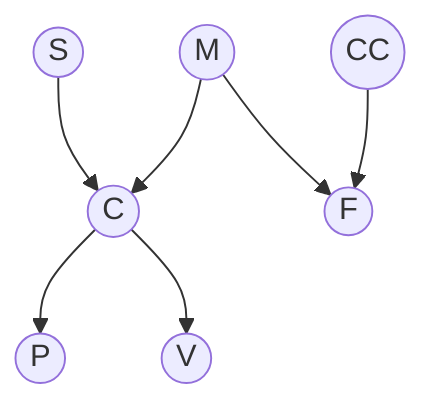
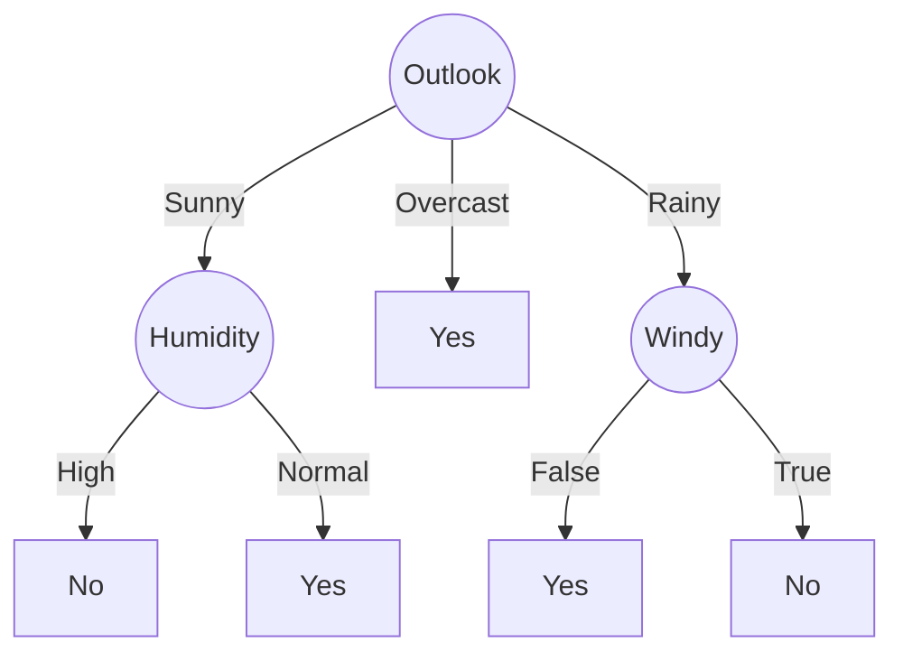
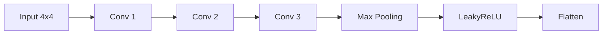

# 高级人工智能笔记

> [!NOTE]
>
> 作者：赤川鹤鸣_Channel | Author: AkagawaTsurunaki | All rights reserved.

## 贝叶斯网络

### 独立性判断

如何证明 $A \perp\!\!\!\perp B \mid C$？

把贝叶斯网络图的箭头忽略，只留下线，看成无向图. 对于从 $A$ 到 $B$ 的其中的一条路径，若满足以下两个条件中的任意一条，则称这条路径是**阻塞** 的

1. 路径中存在某个节点 $X$ 是 head-to-tail 或者 tail-to-tail 节点，并且 $X$ 包含在条件集 $C$ 中；
2. 路径中存在某个节点 $X$ 是 head-to-head 节点，并且 $X$ 或其子节点不包含在条件集 $C$ 中；

如果从 $A$ 到 $B$ 的所有路径都是阻塞的，那么它们就是条件独立的；否则，它们就是非条件独立的. 

### 条件概率的计算

1. 先根据条件概率公式把原式改写为联合分布之商的形式；
2. 根据贝叶斯网络的结构写出联合概率的连乘式子；
3. 把分子的联合概率根据题里的数据算出来；
4. 按照全概率公式，针对非条件变量遍历所有可能的情况，把它做分母. 

**例题：**

判断： (1) $S \perp\!\!\!\perp V$；(2) $S \perp\!\!\!\perp M \mid C$；(3) $P \perp\!\!\!\perp V \mid C$. 

对于 $S \rightarrow C \rightarrow V$，$C$ 是 head-to-tail 节点，但 $C$ 不在条件集 $\varnothing$ 中，$C$ 不阻塞，所以 $S \perp\!\!\!\perp V$ 为 False.

对于 $S \rightarrow C \leftarrow M$，$C$ 是 head-to-head 节点，但 $C$ 在条件集 $\{C\}$ 中，$C$ 不阻塞，所以 $S \perp\!\!\!\perp M \mid C$ 为 False.

对于 $P \leftarrow C \rightarrow M$，$C$ 是 tail-to-tail 节点，$C$ 在条件集 $\{C\}$ 中，$C$ 阻塞，所以 $P \perp\!\!\!\perp V \mid C$ 为 True.

计算条件概率 $P(-m \mid +s, +c, +f, -cc, +v)$ 
$$
\begin{align*}
P(-m \mid +s, +c, +f, -cc, +v) &= \frac{P(-m, +s, +c, +f, -cc, +v)}{P(+s, +c, +f, -cc, +v)} \\
&= \frac{P(-m, +s, +c, +f, -cc, +v)}{P(-m, +s, +c, +f, -cc, +v) + P(+m, +s, +c, +f, -cc, +v)}
\end{align*}
$$

根据贝叶斯网络，有

$$
P(M, S, C, F, CC, V) = P(S) \cdot P(M) \cdot P(CC) \cdot P(C|S,M) \cdot P(F|CC,M) \cdot P(V|C,F)
$$

根据题意，有 $P(-m) = 0.2$，$P(+s) = 0.3$， $P(-cc) = 0.9$，$P(+c \mid +s, -m) = 0.8$，$P(+f \mid -cc, -m) = 0.1$，$P(+v \mid +c, +f) = 0.95$，所以

$$
P(-m, +s, +c, +f, -cc, +v) = 0.2 \times 0.3 \times 0.9 \times 0.8 \times 0.1 \times 0.95 = 0.004104
$$

根据题意，有 $P(+m) = 0.8$，$P(+s) = 0.3$，$P(-cc) = 0.9$，$P(+c \mid +s, +m) = 0.5$，$P(+f \mid -cc, +m) = 0.01$，$P(+v \mid +c, +f) = 0.95$，所以

$$
P(+m, +s, +c, +f, -cc, +v) = 0.8 \times 0.3 \times 0.9 \times 0.5 \times 0.01 \times 0.95 = 0.001026
$$

最后，可得

$$
P(-m \mid +s, +c, +f, -cc, +v) = \dfrac{0.004104}{0.004104 + 0.001026} = 0.8
$$

## 决策树

### 熵

$$
\mathrm{Entropy}(S) = -\sum_{i=1}^{K} p_i \log_2 p_i
$$

均匀分布时熵为 1，确定性取值（例如只有一个可能的取值）时熵为 0. 

### ID3 决策树

| Outlook  | Temperature | Humidity | Windy | Play |
| -------- | ----------- | -------- | ----- | ---- |
| Sunny    | Hot         | High     | False | No   |
| Sunny    | Hot         | High     | True  | No   |
| Overcast | Hot         | High     | False | Yes  |
| Rainy    | Mild        | High     | False | Yes  |
| Rainy    | Cool        | Normal   | False | Yes  |
| Rainy    | Cool        | Normal   | True  | No   |
| Overcast | Cool        | Normal   | True  | Yes  |
| Sunny    | Mild        | High     | False | No   |
| Sunny    | Cool        | Normal   | False | Yes  |
| Rainy    | Mild        | Normal   | False | Yes  |
| Sunny    | Mild        | Normal   | True  | Yes  |
| Overcast | Mild        | High     | True  | Yes  |
| Overcast | Hot         | Normal   | False | Yes  |
| Rainy    | Mild        | High     | True  | No   |

第一步，我们先计算出总熵，整个表格里有 5 个 No，9 个 Yes
$$
\mathrm{Entropy}(S) = -\frac{5}{14} \log_2 \frac{5}{14} -\frac{9}{14} \log_2 \frac{9}{14} = 0.940
$$
第二步，我们分别计算 Outlook、Temperature、Humidity、Windy 的熵. 

对于 Outlook，可能的取值是 Sunny、Overcast、Rainy，那么表格中 (1) 当 Outlook = Sunny 时，有 3 个 No，2 个 Yes；(2) 当 Outlook = Overcast 时，有 0 个 No，有 4 个 Yes；(3) 当 Outlook = Rain 时，有 2 个 No，有 3 个 Yes. 
$$
\mathrm{Entropy}(\text{Outlook}=\text{Sunny}) = -\frac{3}{5} \log_{2} \frac{3}{5} -\frac{2}{5} \log_{2} \frac{2}{5} = 0.971  \\
\mathrm{Entropy}(\text{Outlook}=\text{Overcast}) = -\frac{0}{4} \log_{2} \frac{0}{4} -\frac{4}{4} \log_{2} \frac{4}{4} = 0 \\
\mathrm{Entropy}(\text{Outlook}=\text{Sunny}) = -\frac{2}{5} \log_{2} \frac{2}{5} -\frac{3}{5} \log_{2} \frac{3}{5}  = 0.971
$$
进一步，我们求 Outlook 的加权求和熵
$$
\begin{align*}
\mathrm{Entropy}(\text{Outlook}) &= \dfrac{5}{14} \times \mathrm{Entropy}(\text{Outlook}=\text{Sunny}) + \dfrac{4}{14} \times \mathrm{Entropy}(\text{Outlook}=\text{Overcast}) + \dfrac{5}{14} \times \mathrm{Entropy}(\text{Outlook}=\text{Sunny}) \\
&= \dfrac{5}{14} \times  0.971  + \dfrac{4}{14} \times 0 + \dfrac{5}{14} \times 0.971 \\
&= 0.694
\end{align*}
$$
再对于 Temperature、Humidity、Windy 也和上面一样，即
$$
\mathrm{Entropy}(\text{Temperature}) = 0.911 \\
\mathrm{Entropy}(\text{Humidity}) = 0.789 \\
\mathrm{Entropy}(\text{Windy}) = 0.892
$$
最后算出信息增益
$$
\mathrm{Gain}(\text{Outlook}) = \mathrm{Entropy}(S) - \mathrm{Entropy}(\text{Outlook}) = 0.940-0.694=0.246 \\
\mathrm{Gain}(\text{Temperature}) = \mathrm{Entropy}(S) - \mathrm{Entropy}(\text{Temperature}) = 0.940-0.911=0.029 \\
\mathrm{Gain}(\text{Humidity}) = \mathrm{Entropy}(S) - \mathrm{Entropy}(\text{Humidity}) = 0.940-0.789=0.151 \\
\mathrm{Gain}(\text{Windy}) = \mathrm{Entropy}(S) - \mathrm{Entropy}(\text{Windy}) = 0.940-0.892=0.048
$$
这里最大的信息增益是来自于 Outlook，所以选择 **Outlook**. 

第三步，递归地求解剩余的属性，现在还剩 Temperature、Humidity、Windy 可以选择，这里需要注意，和第一步类似，我们也有算出总熵，但是是 Outlook 的熵，因为我们第二步选择了 Outlook. 然后接着计算信息增益，找出最大的那个信息增益，这里应该是 Humidity. 

第四步，同理，选出 Windy. 

最后完成了整个树的构建. 

### C4.5 决策树

与上面的类似，但是利用增益率来计算，以 Outlook 为例，可能的取值是 Sunny、Overcast、Rainy. 
$$
\mathrm{InitInfo}(\text{Outlook}) = -\frac{5}{14} \log_2 \frac{5}{14} -\frac{4}{14} \log_2 \frac{4}{14} = 1.577 \\
\mathrm{GainRatio}(\text{Outlook}) = \frac{\mathrm{Gain}(\text{Outlook})}{\mathrm{InitInfo}(\text{Outlook})} = \frac{0.246}{1.577} = 0.156
$$
然后也是找最大的增益率即可. 

## 卷积神经网络

在CNN（卷积神经网络）的前向传播过程中，网络模型及其输入如下. （注意：使用 0 padding）

给定的输入矩阵为 $ \begin{bmatrix} 5 & 2 & 0 & 1 \\ 2 & 6 & 0 & 2 \\ 1 & -1 & 5 & -3 \\ 0 & 3 & -2 & 0 \end{bmatrix} $，$\mathrm{LeakyReLU}(x) = \begin{cases} x, &  x > 0 \\ 0.01x, &  x \leq 0 \end{cases}$.

| 层（layer） | 卷积核数量 | 卷积核（kernel）                                             | 步长（stride） | 填充（padding） |
| ----------- | ---------- | ------------------------------------------------------------ | -------------- | --------------- |
| Conv1       | 1          | $\begin{bmatrix} 2 \end{bmatrix}$                            | 1              | 0               |
| Conv2       | 2          | $\begin{bmatrix} 1 & 0 \\ 2 & 1 \end{bmatrix}, \begin{bmatrix} 1 & 1 \\ 0&2 \end{bmatrix}$ （对于每个输入） | 1              | 0               |
| Conv3       | 1          | $\left( \begin{bmatrix} 3 & 0 \\ -1 & 2 \end{bmatrix}, \begin{bmatrix} 2 & 0 \\ -2 & 1 \end{bmatrix} \right)$ （对于每个通道） | 1              | 1               |
| Max Pooling | 1          | 核大小为2                                                    | 2              | 0               |

(1) 写出经过 `Conv2` 后的特征图；

(2) 写出经过 `LeakyReLU` 激活后的输出；

(3) Softmax 函数为 $ F(x_i) = \dfrac{e^{x_i}}{\sum_{i=1}^{n} e^{x_i}} $，损失函数是 Softmax 交叉熵损失 $E(t, y) = -\sum_{j=1}^{n} t_j \log(y_j) $，期望输出（标签）是 $(1,0,0,0)$，请计算给定输入的损失. （需要计算过程）

**解：**

**(1)** 在 Input → Conv1 时，因为卷积核仅为一个标量，相当于矩阵数乘，所以 Conv1 的输出是
$$
2 \begin{bmatrix} 5 & 2 & 0 & 1 \\ 2 & 6 & 0 & 2 \\ 1 & -1 & 5 & -3 \\ 0 & 3 & -2 & 0 \end{bmatrix} = 
 \begin{bmatrix} 10 & 4 & 0 & 2 \\ 4 & 12 & 0 & 4 \\ 2 & -2 & 10 & -6 \\ 0 & 6 & -4 & 0 \end{bmatrix}
$$
Conv2 有两个卷积核，先算第一个 $\begin{bmatrix} 1 & 0 \\ 2 & 1 \end{bmatrix}$，由于没有填充，步长为1，即

对于 Conv1 的输出的第一行做卷积有

$$
\begin{bmatrix}
10 & 4 \\
4 & 12
\end{bmatrix}
\odot
\begin{bmatrix}
1 & 0 \\
2 & 1
\end{bmatrix}
=10\cdot1+4\cdot0+4\cdot2+12\cdot1=30
$$

$$
\begin{bmatrix}
4 & 0 \\
12 & 0
\end{bmatrix}
\odot
\begin{bmatrix}
1 & 0 \\
2 & 1
\end{bmatrix}
=4\cdot1+0\cdot0+12\cdot2+0\cdot1=28\\
$$

$$
\begin{bmatrix}
0 & 2 \\
0 & 4
\end{bmatrix}
\odot
\begin{bmatrix}
1 & 0 \\
2 & 1
\end{bmatrix}
=0\cdot1+2\cdot0+0\cdot2+4\cdot1=4
$$

这样 Conv2 的输出（对于此卷积核）的第 1 行元素就分别是，30，28，4. 

接着同理在第二行有

$$
\begin{bmatrix}
4 & 12 \\
2 & -2
\end{bmatrix}
\odot
\begin{bmatrix}
1 & 0 \\
2 & 1
\end{bmatrix}
=4\cdot1+12\cdot0+2\cdot2+(-2)\cdot1=6
$$

$$
\begin{bmatrix}
12 & 0 \\
-2 & 10
\end{bmatrix}
\odot
\begin{bmatrix}
1 & 0 \\
2 & 1
\end{bmatrix}
=12\cdot1+0\cdot0+(-2)\cdot2+10\cdot1=18
$$

$$
\begin{bmatrix}
0 & 4 \\
10 & -6
\end{bmatrix}
\odot
\begin{bmatrix}
1 & 0 \\
2 & 1
\end{bmatrix}
=0\cdot1+4\cdot0+10\cdot2+(-6)\cdot1=14
$$

这样 Conv2 的输出（对于此卷积核）的第 2 行元素就分别是，6，18，14. 

$$
\begin{bmatrix}
2 & -2 \\
0 & 6
\end{bmatrix}
\odot
\begin{bmatrix}
1 & 0 \\
2 & 1
\end{bmatrix}
=2\cdot1+(-2)\cdot0+0\cdot2+6\cdot1=8
$$

$$
\begin{bmatrix}
-2 & 10 \\
6 & -4
\end{bmatrix}
\odot
\begin{bmatrix}
1 & 0 \\
2 & 1
\end{bmatrix}
=-2\cdot1+10\cdot0+6\cdot2+(-4)\cdot1=6
$$

$$
\begin{bmatrix}
10 & -6 \\
-4 & 0
\end{bmatrix}
\odot
\begin{bmatrix}
1 & 0 \\
2 & 1
\end{bmatrix}
=10\cdot1+(-6)\cdot0+(-4)\cdot2+0\cdot1=2
$$

这样 Conv2 的输出（对于此卷积核）的第 3 行元素就分别是，8，6，2. 

因此对于此卷积核来说，Conv2 的输出特征图为

$$
\begin{bmatrix}
30 & 28 & 4 \\
6 & 18 & 14 \\
8 & 6 & 2
\end{bmatrix}
$$

同理，可以计算在卷积核 $\begin{bmatrix} 1 & 1 \\ 0&2 \end{bmatrix}$ 下，Conv2 的输出特征图为
$$
\begin{bmatrix}
38 & 4 & 10 \\
12 & 32 & -8 \\
12 & 0 & 4
\end{bmatrix}
$$
(2) 接着计算到 Conv3，注意到 Conv3 只有 1 个卷积核，把 $\left( \begin{bmatrix} 3 & 0 \\ -1 & 2 \end{bmatrix}, \begin{bmatrix} 2 & 0 \\ -2 & 1 \end{bmatrix} \right)$ 视为一个整体，从而对 Conv2 的输出特征图（2个，即 2 个通道）合并为 1 个. 

还要注意，Conv3 含有 padding 1，所以上一题的输出要加 1 圈 padding，即
$$
\begin{bmatrix}
0 & 0 &0 &0 &0 \\
0 &30 & 28 & 4&0 \\
0 &6 & 18 & 14&0 \\
0 & 8 & 6 & 2&0 \\
0 & 0 &0 &0 &0
\end{bmatrix} \quad 
\begin{bmatrix}
0 & 0 &0 &0 &0 \\
0 &38 & 4 & 10 &0\\
0 &12 & 32 & -8 &0\\
0 &12 & 0 & 4&0 \\
0 & 0 &0 &0 &0
\end{bmatrix}
$$
这样 Conv3 输出的第 1 行第 1 个元素就是
$$
\begin{bmatrix}
0 & 0 \\
0 & 30 \\
\end{bmatrix} \odot 
\begin{bmatrix} 3 & 0 \\ -1 & 2 \end{bmatrix} +
\begin{bmatrix}
0 & 0 \\
0 & 38 \\
\end{bmatrix} \odot
\begin{bmatrix} 2 & 0 \\ -2 & 1 \end{bmatrix}
= 98
$$

> [!TIP]
>
> 易错点：这与 Conv2 可不一样，因为 Conv2 是两个卷积核，作用是分离特征，但是Conv3 是 1 个卷积核，作用是合并特征. 

同理，第 1 行第 2 个元素就是

$$
\begin{bmatrix}
0 & 0 \\
30 & 28 \\
\end{bmatrix} \odot 
\begin{bmatrix} 3 & 0 \\ -1 & 2 \end{bmatrix} +
\begin{bmatrix}
0 & 0 \\
38 & 4 \\
\end{bmatrix} \odot
\begin{bmatrix} 2 & 0 \\ -2 & 1 \end{bmatrix}
= -46
$$

剩下的就不再赘述，和之前算卷积的流程一样，这里直接给出答案

$$
\begin{bmatrix}
98 & -46 & -18 & -24 \\
24 & 204 & 30 & 34 \\
28 & 22 & 120 & 16 \\
0 & 48 & 18 & 14
\end{bmatrix}
$$

然后，是 Max pooling 最大池化层，这里的操作和卷积很像，不过不是乘积求和，而是找到 $2 \times 2$ 范围内最大的那个，例如

$$
\max \begin{bmatrix}
98 & -46 \\
24 & 204 \\
\end{bmatrix} = 204
$$

这里需要注意，最大池化层的设置为步长 2，所以从左到右跳 2 格，那么下一个元素应该是

$$
\max \begin{bmatrix}
-18 & -24 \\
30 & 34 \\
\end{bmatrix} = 34
$$

下一行也要跳两格，也就是

$$
\max \begin{bmatrix}
28 & 22 \\
0 & 48 \\
\end{bmatrix} = 48 
,\quad 
\max \begin{bmatrix}
120 & 16 \\
18 & 14 \\
\end{bmatrix} = 120 
$$

这样就得到了最大池化层的输出

$$
\begin{bmatrix}
204 & 34 \\
48 & 120 \\
\end{bmatrix}
$$

后面紧跟着一个非线性激活函数 LeakyReLU，即

$$
\begin{bmatrix}
\mathrm{LeakyReLU}(204) & \mathrm{LeakyReLU}(34) \\
\mathrm{LeakyReLU}(48) & \mathrm{LeakyReLU}(120) \\
\end{bmatrix}
 =
 \begin{bmatrix}
204 & 34 \\
48 & 120 \\
\end{bmatrix}
$$
(3) 根据 (2) 的结果，把它展平后得到 $(204, 34, 48, 120 )$. 

经过 Softmax 函数后，得到的结果是（浮点误差截断，因为指数激增）
$$
\left( \frac{e^{204}}{e^{204} + e^{34} + e^{48} + e^{120}}, \frac{e^{34}}{e^{204} + e^{34} + e^{48} + e^{120}},
\frac{e^{48}}{e^{204} + e^{34} + e^{48} + e^{120}}, \frac{e^{120}}{e^{204} + e^{34} + e^{48} + e^{120}}
\right) = (1, 0, 0, 0)
$$
交叉熵损失函数为
$$
E(t, y) = -\sum_{j=1}^{n} t_j \log(y_j) = - 1 \times \log1 + 0 \log 0+ 0 \log 0+ 0 \log 0 = 0
$$
