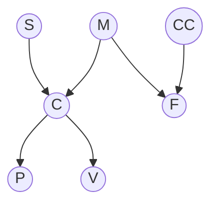
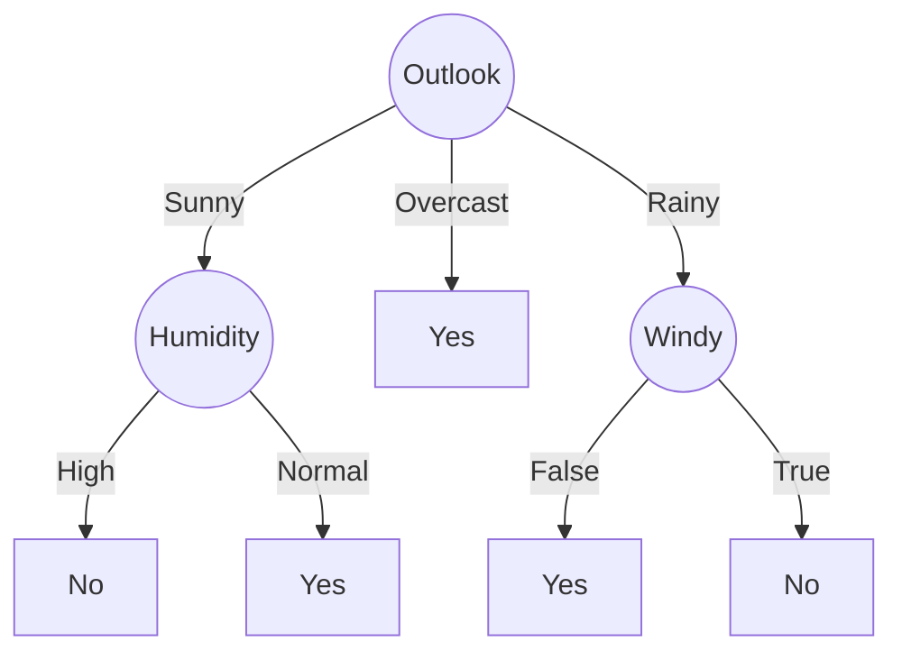

# 高级人工智能笔记

> [!NOTE]
>
> 作者：赤川鹤鸣_Channel | Author: AkagawaTsurunaki | All rights reserved.

## 贝叶斯网络

### 独立性判断

如何证明 $A \perp\!\!\!\perp B \mid C$？

把贝叶斯网络图的箭头忽略，只留下线，看成无向图. 对于从 $A$ 到 $B$ 的其中的一条路径，若满足以下两个条件中的任意一条，则称这条路径是**阻塞** 的

1. 路径中存在某个节点 $X$ 是 head-to-tail 或者 tail-to-tail 节点，并且 $X$ 包含在条件集 $C$ 中；
2. 路径中存在某个节点 $X$ 是 head-to-head 节点，并且 $X$ 或其子节点不包含在条件集 $C$ 中；

如果从 $A$ 到 $B$ 的所有路径都是阻塞的，那么它们就是条件独立的；否则，它们就是非条件独立的. 

### 条件概率的计算

1. 先根据条件概率公式把原式改写为联合分布之商的形式；
2. 根据贝叶斯网络的结构写出联合概率的连乘式子；
3. 把分子的联合概率根据题里的数据算出来；
4. 按照全概率公式，针对非条件变量遍历所有可能的情况，把它做分母. 

**例题：**

判断： (1) $S \perp\!\!\!\perp V$；(2) $S \perp\!\!\!\perp M \mid C$；(3) $P \perp\!\!\!\perp V \mid C$. 

对于 $S \rightarrow C \rightarrow V$，$C$ 是 head-to-tail 节点，但 $C$ 不在条件集 $\varnothing$ 中，$C$ 不阻塞，所以 $S \perp\!\!\!\perp V$ 为 False.

对于 $S \rightarrow C \leftarrow M$，$C$ 是 head-to-head 节点，但 $C$ 在条件集 $\{C\}$ 中，$C$ 不阻塞，所以 $S \perp\!\!\!\perp M \mid C$ 为 False.

对于 $P \leftarrow C \rightarrow M$，$C$ 是 tail-to-tail 节点，$C$ 在条件集 $\{C\}$ 中，$C$ 阻塞，所以 $P \perp\!\!\!\perp V \mid C$ 为 True.

计算条件概率 $P(-m \mid +s, +c, +f, -cc, +v)$ 
$$
\begin{align*}
P(-m \mid +s, +c, +f, -cc, +v) &= \frac{P(-m, +s, +c, +f, -cc, +v)}{P(+s, +c, +f, -cc, +v)} \\
&= \frac{P(-m, +s, +c, +f, -cc, +v)}{P(-m, +s, +c, +f, -cc, +v) + P(+m, +s, +c, +f, -cc, +v)}
\end{align*}
$$

根据贝叶斯网络，有

$$
P(M, S, C, F, CC, V) = P(S) \cdot P(M) \cdot P(CC) \cdot P(C|S,M) \cdot P(F|CC,M) \cdot P(V|C,F)
$$

根据题意，有 $P(-m) = 0.2$，$P(+s) = 0.3$， $P(-cc) = 0.9$，$P(+c \mid +s, -m) = 0.8$，$P(+f \mid -cc, -m) = 0.1$，$P(+v \mid +c, +f) = 0.95$，所以

$$
P(-m, +s, +c, +f, -cc, +v) = 0.2 \times 0.3 \times 0.9 \times 0.8 \times 0.1 \times 0.95 = 0.004104
$$

根据题意，有 $P(+m) = 0.8$，$P(+s) = 0.3$，$P(-cc) = 0.9$，$P(+c \mid +s, +m) = 0.5$，$P(+f \mid -cc, +m) = 0.01$，$P(+v \mid +c, +f) = 0.95$，所以

$$
P(+m, +s, +c, +f, -cc, +v) = 0.8 \times 0.3 \times 0.9 \times 0.5 \times 0.01 \times 0.95 = 0.001026
$$

最后，可得

$$
P(-m \mid +s, +c, +f, -cc, +v) = \dfrac{0.004104}{0.004104 + 0.001026} = 0.8
$$

## 决策树

### 熵

$$
\mathrm{Entropy}(S) = -\sum_{i=1}^{K} p_i \log_2 p_i
$$

均匀分布时熵为 1，确定性取值（例如只有一个可能的取值）时熵为 0. 

### ID3 决策树

| Outlook  | Temperature | Humidity | Windy | Play |
| -------- | ----------- | -------- | ----- | ---- |
| Sunny    | Hot         | High     | False | No   |
| Sunny    | Hot         | High     | True  | No   |
| Overcast | Hot         | High     | False | Yes  |
| Rainy    | Mild        | High     | False | Yes  |
| Rainy    | Cool        | Normal   | False | Yes  |
| Rainy    | Cool        | Normal   | True  | No   |
| Overcast | Cool        | Normal   | True  | Yes  |
| Sunny    | Mild        | High     | False | No   |
| Sunny    | Cool        | Normal   | False | Yes  |
| Rainy    | Mild        | Normal   | False | Yes  |
| Sunny    | Mild        | Normal   | True  | Yes  |
| Overcast | Mild        | High     | True  | Yes  |
| Overcast | Hot         | Normal   | False | Yes  |
| Rainy    | Mild        | High     | True  | No   |

第一步，我们先计算出总熵，整个表格里有 5 个 No，9 个 Yes
$$
\mathrm{Entropy}(S) = -\frac{5}{14} \log_2 \frac{5}{14} -\frac{9}{14} \log_2 \frac{9}{14} = 0.940
$$
第二步，我们分别计算 Outlook、Temperature、Humidity、Windy 的熵. 

对于 Outlook，可能的取值是 Sunny、Overcast、Rainy，那么表格中 (1) 当 Outlook = Sunny 时，有 3 个 No，2 个 Yes；(2) 当 Outlook = Overcast 时，有 0 个 No，有 4 个 Yes；(3) 当 Outlook = Rain 时，有 2 个 No，有 3 个 Yes. 
$$
\mathrm{Entropy}(\text{Outlook}=\text{Sunny}) = -\frac{3}{5} \log_{2} \frac{3}{5} -\frac{2}{5} \log_{2} \frac{2}{5} = 0.971  \\
\mathrm{Entropy}(\text{Outlook}=\text{Overcast}) = -\frac{0}{4} \log_{2} \frac{0}{4} -\frac{4}{4} \log_{2} \frac{4}{4} = 0 \\
\mathrm{Entropy}(\text{Outlook}=\text{Sunny}) = -\frac{2}{5} \log_{2} \frac{2}{5} -\frac{3}{5} \log_{2} \frac{3}{5}  = 0.971
$$
进一步，我们求 Outlook 的加权求和熵
$$
\begin{align*}
\mathrm{Entropy}(\text{Outlook}) &= \dfrac{5}{14} \times \mathrm{Entropy}(\text{Outlook}=\text{Sunny}) + \dfrac{4}{14} \times \mathrm{Entropy}(\text{Outlook}=\text{Overcast}) + \dfrac{5}{14} \times \mathrm{Entropy}(\text{Outlook}=\text{Sunny}) \\
&= \dfrac{5}{14} \times  0.971  + \dfrac{4}{14} \times 0 + \dfrac{5}{14} \times 0.971 \\
&= 0.694
\end{align*}
$$
再对于 Temperature、Humidity、Windy 也和上面一样，即
$$
\mathrm{Entropy}(\text{Temperature}) = 0.911 \\
\mathrm{Entropy}(\text{Humidity}) = 0.789 \\
\mathrm{Entropy}(\text{Windy}) = 0.892
$$
最后算出信息增益
$$
\mathrm{Gain}(\text{Outlook}) = \mathrm{Entropy}(S) - \mathrm{Entropy}(\text{Outlook}) = 0.940-0.694=0.246 \\
\mathrm{Gain}(\text{Temperature}) = \mathrm{Entropy}(S) - \mathrm{Entropy}(\text{Temperature}) = 0.940-0.911=0.029 \\
\mathrm{Gain}(\text{Humidity}) = \mathrm{Entropy}(S) - \mathrm{Entropy}(\text{Humidity}) = 0.940-0.789=0.151 \\
\mathrm{Gain}(\text{Windy}) = \mathrm{Entropy}(S) - \mathrm{Entropy}(\text{Windy}) = 0.940-0.892=0.048
$$
这里最大的信息增益是来自于 Outlook，所以选择 **Outlook**. 

第三步，递归地求解剩余的属性，现在还剩 Temperature、Humidity、Windy 可以选择，这里需要注意，和第一步类似，我们也有算出总熵，但是是 Outlook 的熵，因为我们第二步选择了 Outlook. 然后接着计算信息增益，找出最大的那个信息增益，这里应该是 Humidity. 

第四步，同理，选出 Windy. 

最后完成了整个树的构建. 

### C4.5 决策树

与上面的类似，但是利用增益率来计算，以 Outlook 为例，可能的取值是 Sunny、Overcast、Rainy. 
$$
\mathrm{InitInfo}(\text{Outlook}) = -\frac{5}{14} \log_2 \frac{5}{14} -\frac{4}{14} \log_2 \frac{4}{14} = 1.577 \\
\mathrm{GainRatio}(\text{Outlook}) = \frac{\mathrm{Gain}(\text{Outlook})}{\mathrm{InitInfo}(\text{Outlook})} = \frac{0.246}{1.577} = 0.156
$$
然后也是找最大的增益率即可. 