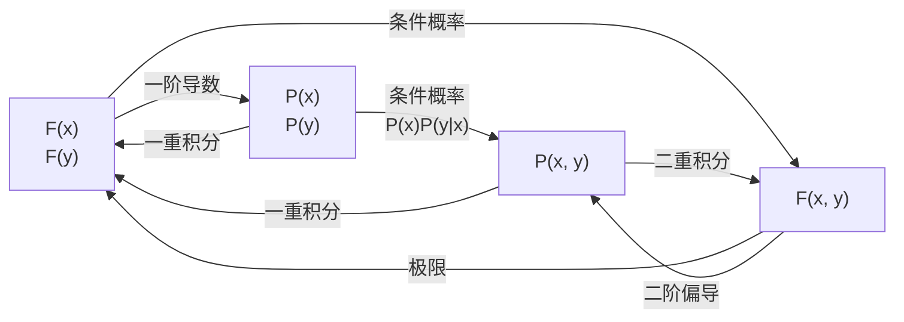
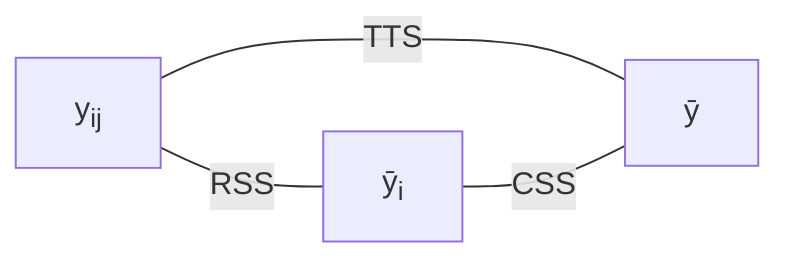

# 应用数理统计笔记

> 笔记作者：赤川鹤鸣\_Channel
>
> 发布网站：https://akagawatsurunaki.github.io
>
> 参考资料：
>
> 1. 孙飞. 应用数理统计[DB/OL]. 沈阳：东北大学数学系, 2025.
> 2. 孙荣恒. 应用数理统计[M]. 第三版. 北京：科学出版社, 2014.

> [!CAUTION]
>
> 作者无法保证所有内容都精确无误，**请自行甄别笔记中的内容**. 同时，本笔记本身是**免费公开**的，作者没有以任何方式采取收费！
>
> 因考试范围限制，相对于孙荣恒著的原书《应用数理统计（第三版）》，本笔记**没有包含**以下内容：2.6 截尾寿命试验中指数分布和几何分布的参数估计、3.2.8 截尾试验中指数分布参数的假设检验、3.4 一致最优势检验、3.5 质量控制、4.2 双因素方差分析、4.3 正交试验设计、5.4 带有线性约束的线性回归模型.

## 概率论基础

### 离散分布

#### 两点分布（Bernoulli 分布）

单试验，成功概率 $p$

$$
X \sim \mathrm{Bernoulli}(p)
$$

**概率密度函数**

$$
P(X=1)=p, P(X=0)=1-p
$$

**期望与方差**

$$
E(X) = p \hspace{2em} D(X) = p(1-p)
$$

#### 二项分布

$n$ 次独立伯努利试验，成功次数

$$
X \sim \mathrm{Bin}(n, p)
$$

**概率质量函数**

$$
P(X=k) = \binom{n}{k} p^k (1-p)^{n-k},\ k=0,1,\dots,n
$$

**期望与方差**（思考可加性）

$$
E(X) = np \hspace{2em} D(X)=np(1-p)
$$

#### 超几何分布

总体 $N$ 件，其中 $M$ 件“成功”，无放回抽取 $n$ 件.

**概率质量函数**

$$
P(X=k)=\frac{{\displaystyle\binom{M}{k}\binom{N-M}{n-k}}}{{\displaystyle\binom{N}{n}}},\quad k=\max(0,n+M-N),\dots,\min(n,M).
$$

**期望与方差**

$$
E(X) = n \dfrac{M}{N} \hspace{2em} D(X) = \dfrac{nM (N-n) (N-M)}{N^2 (N - 1)}
$$

**抽小球问题：**有放回，二项分布（变量独立同分布）；无放回，超几何分布（变量同分布，不独立）. 小球无穷多，超几何分布收敛于二项分布.

#### 泊松分布

**概率质量函数**

$$
P(X=k) = \dfrac{\lambda^k}{k!} e^{-\lambda}, k=0, 1,2,3, \dots
$$

**期望与方差**

$$
E(X) = D(x) = \lambda
$$

**伯努利 → 泊松：**$np_n \rightarrow \lambda > 0$

1. 大量的独立重复试验，稀有事件发生的次数.
2. **平稳性**，事件发生的次数仅与时间长度有关，而与时间起点无关.
3. **独立增量性**，不相交的时间段内，事件发生独立.
4. **普通性**，充分短的时间段内（瞬间），事件至少发生2次的概率是 $P(N(t) \geq 2) = o(\Delta t)$.

#### 几何分布

独立伯努利序列首次成功所需的试验次数.

$$
X \sim G(p)
$$

**概率质量函数**

$$
P(X=k)=p(1-p)^{k-1}, \ k \geq 1
$$

**期望与方差**

$$
E(X) = \dfrac{1}{p} \hspace{2em} D(X) = \dfrac{1-p}{p^2}
$$

**无记忆性**

$$
P(X=n+k|X>n) = P(X=k)
$$

---

### 连续分布

#### 均匀分布

$$
X \sim U(a,b)
$$

**概率密度函数**

$$
f(X=x)=\dfrac{1}{b-a} \mathbb{1}(a<x<b)
$$

**期望与方差**

$$
E(X)=\dfrac{a+b}{2} \hspace{2em} D(X)=\dfrac{(b-a)^2}{12}
$$

**伪随机数**：$X \sim U(0,1)$

**正则化**：$ U(a,b) = a + (b-a) U(0,1) $

**特殊性质**

若X的累计概率函数是 $F(X) = P(X<x)$

$F(X) \sim U(0, 1)$

反之，若 $Y \sim U(0, 1)$，则 $F^{-1}(Y)$ 的累计概率函数是 $F(X)$.

#### 指数函数

$$
X \sim E(\lambda)
$$

**概率密度函数**

$$
f(x)=\lambda e^{-\lambda x} ,\ x>0
$$

**累计分布函数**

$$
F(x) = 1-e^{\lambda x}
$$

**期望与方差**

$$
E(X) = \dfrac{1}{\lambda} \hspace{2em} D(X) = \dfrac{1}{\lambda^2}
$$

**特殊性质**

$$
X \sim E(1), \ e^{-X} \sim U(0, 1)
$$

$$
Y \sim U(0,1), \ \dfrac{1}{Y} \sim E(1)
$$

**无记忆性**（所有的连续分布中只有指数分布具有无记忆性）：

$$
\forall s, t > 0 \hspace{2em} \ P(X>s+t|X>s)=P(x>t)
$$

#### 正态分布

一个随机现象由大量独立可忽略的因素总和.

$$
X \sim N(\mu, \sigma^2)
$$

**概率密度函数**

$$
f(x) = \dfrac{1}{\sqrt{2 \pi \sigma^2}} e^{-\frac{(x-\mu)^2}{2\sigma^2}}
$$

**累计分布函数**

$$
\varphi = N(0,1)
$$

$$
\Phi(-x) = 1 - \Phi(x)
$$

**正则化**

$$
N(\mu, \sigma^2) = \mu + \sigma N(0, 1)
$$

**可加性**

$$
a+bN(\mu, \sigma^2) \sim N(a+b\mu, b^2\sigma^2) , \ b\neq 0
$$

$$
X = \mu + \varepsilon \sim N(\mu, \sigma^2), \quad \varepsilon \sim N(0, \sigma^2)
$$

#### Gamma 分布

$$
p(x) = \dfrac{\lambda^{\alpha}}{\Gamma(\alpha)} x^{\alpha -1} e^{-\lambda x}, \ x>0
$$

这里参数 $\alpha > 0$，$\lambda > 0$.

$$
E(X) = \dfrac{\alpha}{\lambda} \quad D(X) = \dfrac{\alpha}{\lambda^2}
$$

伽马积分 $\Gamma(\alpha) = \int _0^{+\infin} x^{\alpha -1} e^{- x} \mathrm{d}x$，$\alpha > 0$.

1. 参数 $\lambda$ 的指数分布就是 $\Gamma(1, \lambda)$.
2. 自由度 $n$ 的卡方分布 $\chi^2(n)$ 就是 $\Gamma(\frac{n}{2}, \frac{1}{2})$.
3. Gamma 分布具有可加性：两个独立随机变量 $X$ 和 $Y$ ，且 $X \sim \Gamma(\alpha, \gamma)$，$Y \sim \Gamma(\beta, \gamma)$，则 $Z = X+Y \sim \Gamma(\alpha + \beta, \gamma)$.
4. 而且如果 $X \sim \Gamma(\alpha, \lambda)$，则 $cX \sim \Gamma(\alpha, \frac{\lambda}{c})$.
5. $\Gamma(\alpha+1) = \alpha \Gamma(\alpha)$

#### Beta 分布

$\mathrm{Beta}(\alpha, \beta)$ 定义在区间 $(0, 1)$ 上的连续概率密度函数

$$
f(x; \alpha, \beta) = \dfrac{\Gamma(\alpha + \beta)}{\Gamma(\alpha)\Gamma(\beta)} x^{\alpha-1} (1-x)^{\beta - 1} = \dfrac{1}{B(\alpha, \beta)} x^{\alpha-1} (1-x)^{\beta - 1}
$$

$$
E(X) = \dfrac{\alpha}{\alpha+\beta} \quad D(X) = \dfrac{\alpha \beta}{(\alpha+\beta)^2 (\alpha+\beta+1)}
$$

#### 帕斯卡分布

$$
P(X=k) = \binom{k-1}{r-1} p^r q ^{k-r} \quad k=r, r+1, \dots
$$

$$
E(X) = \dfrac{r}{p} \quad D(X) = \dfrac{r q}{p^2}
$$

#### 倒 Gamma 分布

$$
f(x; \alpha, \beta) = \dfrac{\beta^\alpha}{\Gamma ({\alpha})} x^{-\alpha-1} e^{-\beta/x} \quad \alpha>0, \beta>0
$$

$$
E(X) = \dfrac{\beta}{\alpha- 1} \quad (\alpha>1)  \quad D(X)=\dfrac{\beta^2}{(\alpha-1)^2 (\alpha-2)} \quad (\alpha>2)
$$

### 分布的可加性

伯努利分布：$B(n_1, p)+B(n_2, p) \sim B(n_1+n_2, p)$

泊松分布：$P(\lambda_1) + P(\lambda_2) \sim P(\lambda_1 + \lambda_2)$

正态分布：$N(\mu_1, \sigma_1^2) + N(\mu_2, \sigma_2^2) \sim N(\mu_1 + \mu_2, \sigma_1^2 + \sigma_2^2)$

伽马分布：$\Gamma(\alpha_1, \lambda) + \Gamma(\alpha_2, \lambda) \sim \Gamma(\alpha_1 + \alpha_2, \lambda) $

### 随机向量

联合分布函数 $F(x, y) = P(X<x, Y<y)$

分布律 $p_{ij} = P(X=x_i, Y=y_j)$

概率密度函数 $P(X=x, Y=y)$

### **关系**

### **判断独立性**

利用**累积分布函数**

$$
F(x) = \lim_{y \rightarrow +\infty}F(x, y) \hspace{2em} F(y) = \lim_{x \rightarrow +\infty}F(x, y)
$$

如果 $F(x,y) = F(x)F(y)$ 则 $X$，$Y$ 独立.

利用**分布律**

对 $p_{ij}$ 行求和，列求和

$$
p_{*j} = \sum{i} p_{ij} \hspace{2em} p_{i*} = \sum{j} p_{ij}
$$

如果 $p_{ij}=p_{i *} p_{* j}$ 则 $X$，$Y$ 独立.

利用**概率密度函数**

若 $p(x, y) = f(x) g(y)$ 可分解为两个独立变量函数的乘积，则 $X$，$Y$ 独立.

### 二维正态分布

$X \sim N(\mu_1, \sigma_1^2) $，$ Y \sim N(\mu_2, \sigma_2^2)$ 的边缘分布也是正态分布.

二维正态随机变量 $X, Y$ 相互独立的充分必要条件是相关系数 $r=0$

$Y|_{X=x} \sim N(\mu_2 + r \sigma_2 \dfrac{x - \mu_1}{\sigma_1}, (1-r^2)\sigma_2^2)$

$\vec{X} \sim N(\vec{\mu} , \mathbb{\Sigma})$，$\mathbb{\Sigma}$ 是 $n$ 阶正定矩阵

$\forall m\leq n ,\ \mathbf{A}_{m\times n} \vec{X} \sim (\mathbf{A} \vec{\mu}, \mathbf{A} \mathbb{\Sigma} \mathbf{A}^T)$

### 条件分布

条件概率的推广

从 $p(x|\theta)$ 到 $h(\theta | x)$.

$\theta$ 是一个具有分布 $h(\theta)$ 的随机变量，如果 $X$ 关于 $\theta$ 具有条件分布 $p(x|\theta)$，则 $X$ 与 $\theta$ 的联合分布是 $h(\theta) \times p(x|\theta)$.

把联合分布对 $\theta$ 积分或求和得到的 $X$ 的边缘分布，再用联合分布除以 $X$ 的边缘分布从而能够得到 $\theta$ 关于 $X$ 的条件分布 $h(\theta|x)$.

### 数字特征

#### **数学期望**

数学期望是随机变量取值的加权平均

$P(X=x_i)=p_i$

$E(X) = \sum_i x_i p_i \hspace{2em} \text{if} \ \sum_{i} |x_i p_i| < + \infty$ （条件收敛的级数）

$E(X) =\int_{-\infty}^{\infty} x p(x) \mathrm{d}x \hspace{2em} \text{if} \  \int_{-\infty}^{\infty} |x p(x)| dx < + \infty$

柯西分布$\dfrac{1}{\pi(1+(x-\theta)^2)} X \in R^1$没有数学期望，因此无法用样本估计 $\theta$，但 $\theta$ 是它的中位数，同时所有分布都有中位数.

数学期望的计算（中位数没有这种性质）：

线性变换的期望：

$$
E(aX + b) = aE(X) + b
$$

和的期望：

$$
E(X + Y) = E(X) + E(Y)
$$

乘积的期望

$$
\mathrm{i.r.v.} \ X, Y \implies E(XY) = E(X)E(Y)
$$

$$
\mathrm{r.v.} \ X, Y \implies  E(XY)=E(X)E(Y)+\mathrm{Cov}(X,Y)
$$

随机变量函数的期望：

$$
E(g(X)) = \sum_{x} g(x)P(X = x)
$$

$$
E(g(X)) = \int_{-\infty}^{\infty} g(x)f(x)dx
$$

#### **方差**

$$
D(X) = E\left[ \left( X-E(X) \right)^2 \right] = E(X^2)-(E(X))^2
$$

$$
A(X) = E(|X-EX|)
$$

$X_1,\dots ,X_n\overset{\text{i.i.d.}}{\sim }N(\mu ,\sigma ^{2})$ 对方差 $\sigma$ 估计，哪个估计更好？

根号下平方和 $\varphi_1 = c_1 \sqrt{ \sum_{k=1}^n (X_k - \bar{X})^2 }$

绝对离差和 $\varphi_2 = c_2 \sum_{k=1}^n|X_k - \bar{X}|$

它们都是无偏估计，然而 $\varphi_2$ 是充分统计量.

**线性变换的方差**

$$
D(aX+b)=a^2 D(X)
$$

**独立随机变量和的方差**

$$
\mathrm{i.r.v.} X, Y \implies D(X+Y)=D(X) + D(Y)
$$

**一般随机变量和的方差**

$$
D(X+Y)=D(X)+D(Y)+2\mathrm{Cov}(X,Y)
$$

#### **切比雪夫不等式**

对于随机变量 $X$，$E(X) = \mu$，$D(X) = \sigma^2$，

$$
\forall \varepsilon > 0 , \ P(|X- \mu| \leq \varepsilon) \geq 1 - \dfrac{\sigma^2}{\varepsilon^2}, \ P(|X- \mu| \geq \varepsilon) \leq \dfrac{\sigma^2}{\varepsilon^2}
$$

近似算概率、估算方差、频率可以收敛到概率.

#### 条件期望

$$
E(Y|X=x)=
\begin{cases}
\sum_j y_j\,P(Y=y_j|X=x), & \text{离散}\\[4pt]
\int_{-\infty}^{\infty} y\,f_{Y|X}(y|x)\,dy, & \text{连续}
\end{cases}
$$

**全期望公式**

$$
E\bigl[E(Y|X)\bigr]=E(Y)
$$

#### **协方差**

$$
\mathrm{Cov}(X,Y)=E\bigl[(X-EX)(Y-EY)\bigr]=E(XY)-E(X)E(Y)
$$

#### **特征函数**

$f(t) = E \left(e^{itX} \right), \ t \in \mathbb{R}^1$

| 分布         | 特征函数                                                |
| ------------ | ------------------------------------------------------- |
| 二项分布     | $ f(t)=(q+pe^{it})^n $                                  |
| Poisson 分布 | $f(t) = e^{\lambda(e^{it} -1)}$                         |
| 均匀分布     | $f(t)=\dfrac{e^{itb}-e^{ita}}{it(b-a)}$                 |
| Gamma 分布   | $ f(t)=\left( 1-\dfrac{it}{\lambda} \right)^{-\alpha} $ |
| 正态分布     | $f(t) = e^{i \mu t - \frac{1}{2} \sigma^2 t^2}$         |

### 大数定律与中心极限定理

**收敛性**

- **依概率收敛**（数列收敛）：$ X_n \xrightarrow{p} X ⇔ \forall \varepsilon>0,\; P(|X_n-X|\ge\varepsilon)\to 0 $
- **依分布收敛**（函数收敛）：$X_n \xrightarrow{d} X ⇔ \forall x \in R^1, \ P(X_n\le x)\to P(X\le x)$
- **几乎处处收敛**：$X_n \xrightarrow{a.s.} X \iff P\!\left(\left\{ \omega : \lim_{n\to+\infty} X_n(\omega) = X(\omega) \right\}\right) = 1$

**大数定律**

$\dfrac{S_n - E(S_n)}{n} \xrightarrow{p} 0$

**中心极限定理**

$\dfrac{S_n - E(S_n)}{\sqrt{D(S_n)}} \xrightarrow{d} N(0, 1)$

$X_1, X_2, ... i.i.d \hspace{2em} E(X_i) = \mu, D(X_i) = \sigma^2$

$\bar{X} = \dfrac{1}{n} \sum_{k=1}^n X_k \xrightarrow{a.s.} \mu$ // 大数定律

设 $\sigma^2 = D(X_k) < + \infty$，

$\dfrac{S_n - n \mu} {\sqrt{n}\sigma} \xrightarrow{d} N(0, 1)$

$\dfrac{\bar{X} - \mu}{\sqrt{\sigma^2 / n}} \sim N(0, 1)$

## 抽样分布

### 统计量

假定 $X_1, \dots, X_n$ 是来自总体 $X$ 的一组样本，$\varphi(\cdot)$ 是一个完全已知的函数，则称 $\varphi(X_1, \dots, X_n)$ 是一个统计量.

统计量自身带有总体中未知参数的信息，但统计量的表达式中**不能出现任何未知的参数**. 把样本“加工”成统计量含有“数据压缩”的意思. 对于要解决的不同的统计问题，必须构造出不同的统计量去处理.

### 充分统计量

假定有统计量 $T = T ( X_1, \dots, X_n )$，如果给定 $T = t$ 时样本 $X_1, \dots, X_n$ 的条件分布与总体参数 $\theta$ 无关，则称 $T$ 是一个**充分统计量**.

充分统计量没有损失样本所包含的总体未知参数的任何信息.

### 概率函数

$$
f(x, \theta) = \Pi_{k=1}^{n} p(x_k, \theta)
$$

#### 因子分解定理

当且仅当概率函数能被分解成

$$
f(x, \theta) = K(T(x), \theta) h(x)
$$

则 $T(X)$ 是一个**充分统计量**. 概率函数在这里被看成是 $x$、$\theta$ 的函数。

### 完备统计量

假定 $T$ 是一个统计量，如果对于任意函数 $\phi(\cdot)$ ，只要 $E_{\theta} \left( \phi(T) \right) = 0$ 就可以推出 $P_{\theta} \left\{\phi(T) = 0 \right\} =1$，对所有的参数 $\theta$ 都成立，则统计量 $T$ 就称为是一个**完备统计量**.

### 指数型分布族

如果总体 $X$ 的密度（或分布律）$p(x,\theta)$ 可表示成

$$
p(x, \theta) = C(\theta) h(x) \exp \left\{ \sum_{i=1}^k b_i (\theta) T_i (x) \right\}
$$

则称 $X$ 的分布是一个指数型分布族.

1. 常见的二项分布、泊松分布、指数分布、 正态分布等都属于指数型分布族.
2. 如果 X 的总体是指数型分布族，则 $\sum T_1(X_1i), \dots, \sum T_k(X_1i)$ 是充分完备统计量.

### 常用的一些统计量

表示“平均”的统计量：样本均值、中位数、众数

表示“变差”的统计量：样本方差（或标准差）、极差

特殊的统计量：顺序统计量

#### 样本均值

$$
\bar{X} = \dfrac{1}{n} \sum_{k=1}^n X_k
$$

反映了样本这组数据的（算术）平均值

#### 中位数

样本中位数：样本按照取值大小排列后居中的那个样本.

总体中位数：$\mathrm{M}(X)$

$$
\mathrm{M}(X) = \inf_x \left\{ x: P(X<x) \geq \dfrac{1}{2} \right\}
$$

中位数比样本均值更为稳健，当二者相差不大时常采用样本均值表示数据平均，否则应该考虑使用中位数.

#### 众数

样本众数：样本数据中出现次数最多的样本.

总体众数：$\mathrm{Mode}(X)$，分布律或者概率密度函数在此达到最大.

#### 样本方差

$$
S^2 = \dfrac{1}{n-1} \sum_{k=1}^n (X_k - \bar{X})^2
$$

$S$ 称为是样本标准差（Standard deviation），与样本均值量纲相同，反映了样本离散程度.

#### 顺序统计量

对于样本 $X_1, \dots , X_n$，对应观察值记为 $x_1, \dots, x_n$，按照样本观察值的大小关系排序 $x_{(1)} ≤ x_{(2)} \leq \dots \leq x_{(n)}$ 相应的样本 $X_{(1)} ≤ X_{(2)} \leq \dots \leq X_{(n)}$ 称为**顺序统计量**.

$X_{(1)}$ 称为**极小统计量**；$X_{(n)}$ 称为**极大统计量**，极差（Range）定义成 $X_{(n)} - X_{(1)}$.

1. 顺序统计量是充分统计量；
2. 如果观察值相同，则序号小的排在前面；
3. 样本在顺序统计量中的位置称为“秩” (Rank).

##### 顺序统计量的联合分布

假定总体具有概率密度函数 p(x)，X1，…，Xn 是一组样本，相应的顺序统计量记为：Yk = X(k) 。

全体顺序统计量的联合概率密度函数

$$
p(y_1, \dots, y_n) = n! p(y_1) \dots p(y_n), \quad y_1 \leq y_2 \leq \cdots \leq y_n
$$

第 $k$ 个顺序统计量 $Y_k = X_{(k)}$ 的概率密度函数

$$
p_k(y) = \dfrac{n!}{(k-1)!(n-k)!} p(y) F(y)^{k-1} \left[ 1- F(y) \right]^{n-k}
$$

极小统计量 $X_{(1)}$ 的概率密度函数是

$$
p_1(y)=np(y)\left[1-F(y) \right]^{n-1}
$$

极大统计量 $X_{(n)}$ 的概率密度函数是

$$
p_n(y) = np(y) (F(y))^{n-1}
$$

任意两个顺序统计量 $(k<r)$ 的联合概率密度函数

$$
p_{k, r}(y_k, y_r) = \dfrac{n!}{(k-1)! (r-k-1)! (n-r)!} p(y_k) p(y_r) \curvearrowright \\ \times (F(y_k))^{k-1}\left[ F(y_r) -F(y_k) \right]^{r-k-1} [1-F(y_r)]^{n-r}, \quad y_k < y_r
$$

极差的概率密度函数

$$
p_{\text{range}}(y) = n(n-1)
 \int_{-\infin}^{\infin} p(x) p(x+y) [F(x+y) - F(x)]^{n-2} \mathrm{d}x, \quad y > 0
$$

1. 极差计算简单，但不如样本标准差稳健；
2. 对于大多数单峰对称分布，标准差大约等于极差的四分之一；
3. 大多数情况下，数据基本上落在“均值±2个标准差”的区间内，否则这个数据就被认为是异常的大或异常的小. 在绝大多数情况下，一组正常数据基本上落在“均值±3个标准差”的区间内.

### 统计学中的三个分布

#### 卡方分布

独立同分布于 N (0,1) 的变量平方和的分布

$$
K^2 = X_1^2 + X_2^2 + \dots + X_n^2, \quad X_1, \dots, X_n \overset{\text{i.i.d.}}{\sim} N(0, 1)
$$

$$
K^2 \sim \chi^2(n)
$$

概率密度函数

$$
k_n(x) = \dfrac{1}{2^{\frac{n}{2}} \Gamma(\frac{n}{2})} x^{\frac{n}{2}-1} e^{-\frac{x}{2}}, \quad x>0
$$

数学期望是 $n$，方差是 $2n$.

卡方分布具有可加性

如果 $X$、$Y$ 独立，$X \sim \chi^2(n_1)$，$Y \sim \chi^2(n_2)$，则 $X+Y \sim \chi^2(n_1+n_2)$.

#### T 分布

独立标准正态变量与卡方变量商的分布. 一般样本容量小于 30 时可用 t 分布

如果 $X$、$Y$ 独立，并且 $X \sim N(0,1)$，$Y \sim \chi^2(n)$，

$$
T = \dfrac{X}{\sqrt{Y/n}}, \quad T \sim t(n)
$$

$t$ 分布的概率密度函数

$$
t_n(x) = \dfrac{\Gamma(\frac{n+1}{2})}{\sqrt{n \pi} \Gamma(\frac{n}{2})} \left( 1+ \frac{x^2}{n} \right)^{-\frac{n+1}{2}}
$$

数学期望是 $0 \ (n \geq 2)$，方差是 $\frac{n}{n-2} \ (n \geq 3)$，$t(1)$ 是 Cauchy 分布.

t 分布的平方 $t^2(n)$ 正好是 $F(1, n)$

当 $n \rightarrow \infin $，$t(n)$ 的极限分布是标准正态分布.

#### F 分布

两个独立的卡方随机变量商的分布.

如果 $X$、$Y$ 独立，并且

$$
X \sim \chi^2(m), \quad Y \sim \chi^2(n), \quad F = \dfrac{X / m}{Y / n}, \quad F \sim F(m, n)
$$

F 分布的概率密度函数

$$
f_{m,n}(x) = \dfrac{\Gamma(\frac{m+n}{2})}{\Gamma(\frac{m}{2}) \Gamma(\frac{n}{2})} m^{\frac{m}{2}} n^{\frac{n}{2}} \dfrac{x^{\frac{m}{2}-1}}{(n+mx)^{\frac{m+n}{2}}}, \quad x > 0
$$

数学期望是 $\frac{n}{n-2} \quad (n \geq 3)$.

如果 $T \sim t(n)$，则有 $T^2 \sim F(1, n)$.

### 正态分布的抽样分布

假定 $X_1, X_2, \dots , X_n$ 是来自总体 $X \sim N(\mu, \sigma^2)$ 的一组简单随机样本；$\bar{X}$ 与 $S^2$ 分别是样本均值与样本方差.

$$
\dfrac{\sqrt{n}(\bar{X} - \mu)}{\sigma} \sim N(0, 1)
\quad
\dfrac{(n-1)S^2}{\sigma^2} \sim \chi^2(n-1)
$$

$$
\bar{X} \ \text{i.i.d} \ S^2 \quad \quad
\dfrac{\sqrt{n} (\bar{X} - \mu)}{S} \sim t(n-1)
$$

### 多元正态分布的基本性质

随机向量 $X$ 服从 $n$ 维正态分布 $N(\mathbf{\mu}, \mathbf{\Sigma})$，如果联合密度是

$$
f(x) = \dfrac{1}{(2 \pi)^{n/2} \sqrt{\det(\mathbf{\Sigma})}} \exp \left( - \dfrac{1}{2} ({x} - \mu)^T \mathbf{\Sigma}^{-1} (x - \mu) \right)
$$

$X$ 服从 $n$ 维正态 $N(\mu, \mathbf{\Sigma})$ 的充分必要条件是

对任意 $n$ 维行向量 $\boldsymbol{a}$，有 $\mathbf{a}^T X \sim N(\mathbf{a}^T \mu, \mathbf{a}^T \mathbf{\Sigma} \mathbf{a})$.

如果 $X \sim N(\mathbf{\mu}, \mathbf{\Sigma})$，$\mathbf{A}$ 是任意 $m \times n$ 矩阵 $(m \leq n)$，则有 $\mathbf{A}X \sim N(\mathbf{A\mu}, \mathbf{A\Sigma} \mathbf{A}^T )$.

### 两个正态总体的抽样分布

假定两组简单随机样本 $X_1, \dots, X_{n_1}$ 与 $Y_1, \dots, Y_{n_2}$ 分别来自两个独立的正态总体 $X \sim N(\mu_1, \sigma_1^2)$ 与 $Y \sim N(\mu_2, \sigma_2^2)$.

$X$ 总体的样本期望与样本方差分别是

$$
\bar{X} = \dfrac{1}{n_1} \sum_{i=1}^{n_1} X_i, \quad S_1^2 = \dfrac{1}{n_1-1} \sum_{i=1}^{n_1} (X_i - \bar{X})^2
$$

$Y$ 总体的样本期望与样本方差分别是

$$
\bar{Y} = \dfrac{1}{n_2} \sum_{j=1}^{n_2} Y_j, \quad S_2^2 = \dfrac{1}{n_2-1} \sum_{j=1}^{n_2} (Y_j - \bar{Y})^2
$$

$$
\dfrac{S_1^2 / S_2^2}{\sigma_1^2 / \sigma_2^2} \sim F(n_1-1, n_2-1)
$$

如果假定 $\sigma_1^2 = \sigma_2^2$，则有

$$
\dfrac{(\bar{X} - \bar{Y}) - (\mu_1 - \mu_2)}{S_w\sqrt{\dfrac{1}{n_1}+\dfrac{1}{n_2}}} \sim t(n_1+n_2 -2), \quad S_w^2 = \dfrac{(n_1-1)S^2_1 + (n_2-1)S_2^2}{n_1+n_2-2}
$$

### Cochren 定理

假定 $X_1, \dots, X_n$ 是来自总体 $X \sim N (0,1)$ 的一组简单随机样本，记 $X = (X_1, \dots ,X_n )^T$，$\mathbf{A}_i ( 1 \leq i \leq r)$ 分别是秩为 $n_i$ 的非负定矩阵，满足

$$
\mathbf{A}_1 + \dots +  \mathbf{A}_r = \mathbf{I}_n
$$

则 $(X_1, \dots, X_n )^T$ 的 $r$ 个二次型 $X^T\mathbf{A}_i X$ 相互独立并且 $X^T \mathbf{A}_i X \sim \chi^2(n_i)$ 的充分必要条件是

$$
n_1+ n_2 + \dots + n_r = n
$$

## 参数估计

### 点估计

点估计利用统计量 $\varphi (X_1, \dots, X_n)$ 的观测值 $\varphi(x_1, \dots, x_n)$ 作为 $\theta$ 的估计值.

#### 矩估计

用样本的有关矩去作为总体有关矩的估计，即样本均值作为总体期望的估计、样本二阶矩作为总体二阶矩的估计、样本中位数（或众数）作为总体中位数( 或众数 ) 的估计等.

对参数 $\theta=(\theta_1,\dots,\theta_m)$，令

$$
\frac{1}{n}\sum_{i=1}^n X_i^j = E(X^j;\theta),\quad j=1,\dots,m
$$

解这 $k$ 个方程，得到矩估计 $\hat{\theta}$.

理论依据：**大数定律**. 矩估计基本上都是依概率或者几乎处处收敛到未知参数.

**注意**

1. 总体的参数不能表示成矩的函数时 ( 一般是总体矩不存在) ，就不能使用矩估计；
2. 如果能够用低阶的矩估计，就不要用高阶矩；
3. 按照矩估计的理论应该用样本的二阶中心矩 来估计总体的方差，但是在实际应用中人们总是采用样本方差作为总体方差的估计；

**优点**

矩估计的最大优点是简单实用，与总体分布形式没有关系. 只要知道总体随机变量一些矩存在，就可以做相应的矩估计.

#### 极大似然估计

所有情况中 “看起来最象” 的那个估计.

把概率函数 $f ( x, \theta )$ 记为似然函数 $L(\theta)$，认为它是 $x$ 固定，关于 $\theta$ 的函数. 对离散总体，它是样本联合分布律；对连续总体，它是样本联合密度函数. 总体参数 $\theta$ 的极大似然估计就是使得似然函数在参数空间 $\Theta$ 中达到极大者.

即对于任意 $\theta \in \Theta$ 都有

$$
L(\hat{\theta}) = \mathrm{max} L(\theta)
$$

一般采用对数似然方程（组）求解极大似然估计

$$
\dfrac{\partial \ln L(\theta)}{\partial \theta} = 0
$$

（无法建立似然方程时，必须根据定义求极大似然估计）

#### 极大似然估计与矩估计的简单比较

矩估计由 K.Pearson 在1894年提出，只要求总体的矩存在即可，不需要知道总体分布. 极大似然估计由 R. A. Fisher 在 1912 年提出的，必须要知道总体来自哪一种分布类型. 因此极大似然估计具有更多数学上的良好性质. 例如 $\sqrt{n} ( \hat{\theta}_n-\theta_{0} \xrightarrow{d} N(0, \mathbf{I}^{-1} (\theta_0)) )$

### 估计量的优良标准

- 无偏性：估计量的数学期望要等于参数；
- 有效性：估计量的方差要比较小（主要是限制在无偏估计的范围内）；
- 相合性：当样本容量趋于无限多时，估计量应该收敛到参数.

#### 无偏性

**无偏估计**

参数 $g(\theta)$ 的估计量 $\varphi(X_1, \dots, X_n) $ 如果满足

$$
\forall \theta \in \Theta, \ E( \varphi(X_1, \dots, X_n) ) = g(\theta)
$$

则称 $\varphi(X_1, \dots, X_n) $ 是 $g(\theta)$ 的一个**无偏估计量**（Unbiased Estimator）.

无偏性是估计好坏的一个基本要求，它表明即使每一次估计都可能有误差，但是从长远来看，这种估计总的误差能够相互抵消.

**利用充分统计量构造无偏估计**

假定样本是 $X_1, \dots , X_n$，充分统计量为 $T$，参数 $g(\theta)$ 的无偏估计量是 $\varphi$，则 $E(\varphi |T )$ 是 $g(\theta)$ 的由充分统计量构成的无偏估计.

#### 有效性

假定 $\varphi( X_1, \dots, X_n)$ 是 $g(\theta)$ 的一个估计，则

$$
\mathrm{MSE}(\varphi) = E \left[ \varphi( X_1, \dots, X_n) - g(\theta) \right]^2 = D(\varphi) + \left( E(\varphi) -g(\theta) \right)^2
$$

称为是估计量 $\varphi( X_1, \dots, X_n)$ 的均方误差（MSE）. MSE 越小估计就越好，无偏估计量的 MSE 就是它的方差.

##### **一致最小方差无偏估计（UMVUE）**

假定 $\varphi_0(X_1, \dots , X_n)$ 是 $g(\theta)$ 的一个无偏估计，并且 $\mathrm{MSE}(\varphi_0 ) ≤ \mathrm{MSE}(\varphi)$ 对 $g(\theta)$ 的任意无偏估计 $\varphi$ 都成立，则称 $\varphi_0(X_1, \dots , X_n)$ 是 $g(\theta)$ 的一致最小方差无偏估计.

显然 $g(\theta)$ 的无偏估计的方差越小越好， 但是这些方差不可能任意地小. $g(\theta)$ 的所有无偏估计的方差有一个公共的下界（C-R下界），方差达到这个下界的无偏估计自然就是一致最小方差无偏估计.

##### Cramér-Rao 不等式

假定 $X_1, \dots, X_n$ 是来自总体 $p(x,\theta )$，$\theta \in \mathbb{R}^1$ 的一组简单随机样本，对于统计量 $\varphi(X_1, \dots , X_n)$，在正则性条件下有

$$
D(\varphi) \geq \dfrac{\left( \dfrac{\partial}{\partial\theta} E(\varphi) \right)^2}{n I(\theta)} \xrightarrow{如果 \varphi 是无偏估计}  D(\varphi) \geq \dfrac{1}{nI(\theta)} \\
I(\theta) = E \left( \dfrac{\partial}{\partial \theta} \ln p(x, \theta) \right)^2 =
\underbrace{
	-E \left( \dfrac{\partial^2}{\partial \theta^2} \ln p(x, \theta) \right)
}_{\text{这个更方便，把参数提出去}}
$$

其中，

1. 正则性指的是支撑集与 $\theta$ 无关（例如指数族与参数无关）；
2. $I(\theta)$ 是总体的 Fisher Information；
3. 这个定义与教材略有区别，是因为教材假定了 $\varphi$ 是无偏估计，即 $E(\varphi) = g(\theta)$.

##### **Blackwell-Lehmann-Sheffe 定理**

如果 $T$ 是充分、完备的统计量，$\varphi(T)$ 是 $g(\theta)$ 的一个无偏估计，则 $\varphi(T)$ 就是 $g(\theta)$ 的一致最小方差无偏估计.

#### 相合估计

对于任意 $\varepsilon > 0$，如果当 $n \rightarrow \infin$ 时，

$$
P \{ \lvert \varphi_n - g(\theta) \rvert > \varepsilon  \} \rightarrow 0
$$

则称 $\varphi_n$ 是 $g(\theta)$ 的相合估计（也称一致估计），即 $\varphi_n$ 依概率收敛到 $g(\theta)$.

**强相合估计**

$$
P \left\{ \varphi_n \rightarrow g(\theta) \right\} = 1
$$

**渐进正态估计**

$$
\dfrac{n^{1/2} \left( \varphi_n - g(\theta) \right)}{\sigma} \rightarrow N(0, 1)
$$

**Delta 方法**

如果 $\sqrt{n} \left( \hat{\theta}_n - \theta_0 \right) \xrightarrow{d} Z, \quad \theta_0 \in \mathbb{R}^p$，$\varphi$ 是 $\mathbb{R}^p \rightarrow \mathbb{R}^1$ 的函数，则

$$
\sqrt{n} \left( \varphi(\hat{\theta}_n) - \varphi(\theta_0)\right) \xrightarrow{d} \nabla_\theta \varphi(\theta)^T |_{\theta=\theta_0} Z
$$

### 常见分布的参数估计

| 分布类型                    | 待估参数   | 无偏估计                                                                                 | 极大似然估计                                       |
| --------------------------- | ---------- | ---------------------------------------------------------------------------------------- | -------------------------------------------------- |
| 正态分布 $N(\mu, \sigma^2)$ | $\mu$      | $\hat{\mu} = \bar{X}$（UMVUE）                                                           | $\hat{\mu}=\bar{X}$                                |
|                             | $\sigma^2$ | $\hat{\sigma}^2 = S^2 = \frac{1}{n-1} \sum_{i=1}^{n} (X_i - \bar{X})$（UMVUE）           | $\hat{\sigma}^2 = \dfrac{n-1}{n}S^2$               |
| 泊松分布 $P(\lambda)$       | $\lambda$  | $\hat{\lambda} = \bar{X}$（UMVUE）                                                       | $\hat{\lambda} = \bar{X}$                          |
| 二项分布 $B(N,p)$           | $p$        | $\hat{p} = \dfrac{\bar{X}}{N}$（UMVUE）                                                  | $\hat{p}=\dfrac{\bar{X}}{N}$                       |
| 指数分布 $E(\lambda )$      | $\lambda$  | $\hat{\lambda} = \dfrac{n-1}{n \bar{X}}$ （UMVUE）                                       | $\hat{\lambda} = \dfrac{1}{\bar{X}}$（渐进无偏）   |
| 均匀分布 $U(a, b)$          | $a, \ b$   | $\hat{a} = \dfrac{nX_{(1)} - X_{n}}{n-1}, \ \hat{b} = \dfrac{n X_{(n)} - X_{(1)} }{n-1}$ | $\hat{a}=X_{(1)}, \ \hat{b} = X_{(n)}$（渐进无偏） |

### 区间估计

精度和置信水平是一对矛盾.

样本统计量（点估计）±抽样误差

1. 枢轴变量 $Z(X, \theta)$ 的分布是与参数 $\theta$ 无关的分布，一般是从 $g(\theta)$ 的良好的点估计出发，去寻找枢轴变量 $Z(X, \theta)$.
2. 求出 $P \{ a < Z(X, \theta) < b \} \geq 1 - \alpha$
3. 变换不等式 $a < Z(X, \theta) < b \leftrightarrow \varphi_1(X) < g(\theta) < \varphi_2(X)$

因此区间 $(\varphi_1, \varphi_2 )$ 就是 $g(\theta)$ 的一个置信度为 $1-\alpha$ 的区间估计.

#### 总体属性比例的置信区间

$$
X_1, \dots , X_n \sim B(1, p) \implies X = \sum_{i=1}^n X_i \sim H(n, np, N) \xrightarrow{N \rightarrow \infin} X \sim B(n, p) \xrightarrow{N \rightarrow \infin} p = p_s
$$

$$
P \left\{ -u_{\alpha/2} < \dfrac{p_s - p}{\sqrt{\dfrac{p_s (1-p_s)}{n}}} < u_{\alpha/2} \right\} = 1-\alpha
$$

$$
\left( p_s - u_{\alpha/2} \sqrt{\dfrac{p_s (1-p_s)}{n}}, \  p_s + u_{\alpha/2} \sqrt{\dfrac{p_s (1-p_s)}{n}} \right)
$$

#### 指数总体参数的置信区间

$$
2 \lambda \sum_{i=1}^{n} X_i \sim \Gamma \left( \dfrac{2n}{2}, \dfrac{1}{2} \right) = \chi^2(2n)
$$

$$
P \left\{ \chi^2_{1-\alpha/2} (2n) < 2n\lambda \bar{X} < \chi^2_{\alpha/2} (2n)  \right\} = 1 - \alpha
$$

$$
\left( \dfrac{\chi^2_{1-\alpha/2}(2n)}{2n\bar{X}} , \dfrac{\chi^2_{\alpha/2}(2n)}{2n\bar{X}}\right)
$$

注意这个区间不一定是最短区间（因为不对称）.

#### 单个正态总体均值的置信区间

$X_1, \dots , X_n \sim N(\mu, \sigma^2)$

##### 总体方差已知

已知 $\sigma^2=\sigma^2_0$，则 $\bar{X} \sim N(\mu, \dfrac{\sigma_o^2}{n})$

$$
P \left\{ \left| \dfrac{\sqrt{n} (\bar{X} - \mu)}{\sigma_0} \right| \leq u_{\alpha/2} \right\} = 1 - \alpha
$$

总体均值 $\mu$ 的 $1-\alpha$ 区间估计为

$$
\left( \bar{X} - u_{\alpha/2} \dfrac{\sigma_0}{\sqrt{n}}, \bar{X} + u_{\alpha/2} \dfrac{\sigma_0}{\sqrt{n}} \right)
$$

##### 总体方差未知

总体方差 $\sigma^2$ 未知，则 $\dfrac{\sqrt{n} (\bar{X} - \mu)}{S} \sim t(n-1)$，因此有

$$
P \left\{ \left| \dfrac{\sqrt{n} (\bar{X} - \mu)}{S} \right| \leq t_{\alpha/2}(n-1) \right\} = 1 - \alpha
$$

总体均值 $\mu$ 的 $1-\alpha$ 区间估计为

$$
\left( \bar{X} - t_{\alpha/2} (n-1) \dfrac{S}{\sqrt{n}} ,\ \bar{X} + t_{\alpha/2} (n-1) \dfrac{S}{\sqrt{n}} \right)
$$

##### 总体均值已知

已知 $\mu=\mu_0$，则 $\dfrac{\sum_{i=1}^n (X_i - \mu_0 )^2}{\sigma^2} \sim \chi^2(n)$

##### 总体均值未知

均值 $\mu$ 未知，则 $\dfrac{\sum_{i=1}^n (X_i - \bar{X} )^2}{\sigma^2} = \dfrac{(n-1)S^2}{\sigma^2}\sim \chi^2(n-1)$

$$
P \left\{ \chi^2_{1-\alpha/2} (n-1) < \dfrac{(n-1)S^2}{\sigma^2} < \chi^2_{\alpha/2} (n-1)  \right\} = 1 - \alpha
$$

总体方差 $\sigma^2$ 的 $1-\alpha$ 区间估计为

$$
\left( \dfrac{(n-1)S^2}{\chi^2_{\alpha/2}(n-1)} ,\  \dfrac{(n-1)S^2}{\chi^2_{1-\alpha/2}(n-1)} \right)
$$

#### 两个正态总体均值差的置信区间

$X*1, \dots, X*{n*1} \sim N(\mu_1, \sigma_1^2), \ Y_1, \dots, Y*{n_2} \sim N(\mu_2, \sigma^2_2) $

$$
\bar{X} = \dfrac{1}{n_1} \sum_{i=1}^{n_1}X_i, \quad S_1^2=\dfrac{1}{n_1 - 1} \sum_{i=1}^{n_1} (X_i - \bar{X})^2
\\
\bar{Y} = \dfrac{1}{n_2} \sum_{j=1}^{n_2}Y_j,\quad S_2^2=\dfrac{1}{n_2 - 1} \sum_{j=1}^{n_2} (Y_i - \bar{Y})^2
$$

从而凑出 t 分布有

$$
\dfrac{(\bar{X} - \bar{Y}) - (\mu_1 - \mu_2)}{S_w \sqrt{\dfrac{1}{n_1} + \dfrac{1}{n_2}}} \sim t(n_1 + n_2 - 2), \quad
S_w^2 = \dfrac{(n_1 - 1 ) S_1^2 + (n_2 -1)S_2^2}{n_1 + n_2 - 2}
$$

因此均值差 $\mu_1 - \mu_2 $ 的 $1-\alpha$ 区间估计为

$$
\left(
\bar{X} - \bar{Y} - t_{\alpha / 2}(n_1 + n_2 - 2) S_w \sqrt{\dfrac{1}{n_1} + \dfrac{1}{n_2}}, \
\bar{X} - \bar{Y} + t_{\alpha / 2}(n_1 + n_2 - 2) S_w \sqrt{\dfrac{1}{n_1} + \dfrac{1}{n_2}}
\right)
$$

#### 两个正态总体方差比的置信区间

$$
\dfrac{S_1^2 / S_2^2}{\sigma_1^2 / \sigma_2^2} \sim F(n_1 -1, n_2 - 1)
$$

因此方差比 $\sigma_1^2 / \sigma_2^2$ 的 $1-\alpha$ 区间估计为

$$
\left(
\dfrac{S_1^2 / S_2^2}{F_{\alpha/2} (n_1 -1, n_2 - 1)}, \
\dfrac{S_1^2 / S_2^2}{F_{1 - \alpha/2} (n_1 -1, n_2 - 1)}
\right)
$$

### 贝叶斯估计

#### 损失函数

平方损失：$L(\theta, d ) = (\theta -d )^2$

绝对损失：$L(\theta, d ) = |\theta - d |$

#### 风险函数

$$
R( \theta, \delta ) = E_{\theta} \left[ L( \theta, \delta(X1, \dots, Xn)) \right] \quad d = \delta(X1, \dots, Xn)
$$

#### 统计决策观点下的估计与检验

##### 点估计

在参数点估计问题中常常取平方损失函数，此时风险函数就是一个估计量的均方误差. 一致最小方差无偏估计（UMVUE）就是在无偏估计类中，平方损失下风险最小.

##### 假设检验

在假设检验问题中，取决策空间 $D = \{ 0,1 \}$，其中 $k$ 表示接受假设 $H_k$，损失函数为 0-1 损失，风险函数为 $R(\theta, \phi)$

$$
L(\theta, k) =
\begin{cases}
0 \quad & \text{if} \ \theta \in \Theta_k, \\[4pt]
1 \quad & \text{if} \ \theta \in \Theta_{i-k}
\end{cases}
\implies

R(\theta, \phi) =
\begin{cases}
\beta_{\phi}(\theta) & \text{if} \ \theta \in \Theta_0,  \\[4pt]
1 - \beta_{\phi}(\theta) & \text{if} \ \theta \in \Theta_{1}
\end{cases}
$$

Neyman-Pearson 的假设检验理论，即指定一个 $0 < \alpha < 1$，把风险函数 $R(\theta, \phi)$ 在 $\Theta_0$ 上的取值控制为不超过 $\alpha$，同时使得 $R(\theta, \phi)$ 在 $\Theta_1$ 上尽量小.

##### 区间估计

在区间估计理论中，取决策空间 $D$ 为全部区间 $(a,b)$ 的集合，损失函数一共有两个

$L_1$ 是 0-1 损失函数

$$
L_1(\theta, (a,b )) =
\begin{cases}
0 & \text{if} \ a < \theta <b \\[4pt]
1 & \text{else}
\end{cases}
$$

$L_2$ 反映了区间的精度

$$
L2(\theta ,(a,b) ) =  b - a
$$

对于任意一个区间估计 $\delta(x) = (\varphi_1(x),\varphi_2(x))$，损失函数 $L_1$ 导致风险函数

$$
R_1(\theta,\delta)= 1 - P\left\{ \varphi_1(x) < \theta < \varphi_2(x) \right\}
$$

而损失 $L_2$ 的风险函数是区间平均长度

$$
R_2(\theta, \delta) = E \left[ \varphi_2(x) -\varphi_1(x) \right]
$$

指定置信度为 $1 - \alpha$ 就理解为 $R_1 (\theta, \delta) \leq \alpha$，然后在这个条件下要求 $R_2 (\theta, \delta)$ 尽可能地小.

#### 决策原则

Minimax 决策（极小化极大方法）：对每一个决策都考虑最坏的可能状态，然后选择那个对于全部最坏状态而言是最佳的决策.

Bayes 决策：对于参数 $\theta$ 定义一个概率分布（称为先验分布），把风险函数 $R(\theta, d)$ 关于这个先验分布取数学期望（称为 Bayes 风险），在决策空间 $D$ 中取使得Bayes 风险最小的那一个作为问题的解.

#### 共轭分布

##### 正态分布共轭与正态分布

$X \sim N( \theta, \sigma^2), \ \theta \sim N(\mu_0, \sigma^2_0)$

$$
\theta | X \sim N \left( \dfrac{\mu_0 \sigma^2 + n \bar{x} \sigma^2_0}{\sigma^2 + n \sigma^2_0}, \dfrac{\sigma_0^2 \sigma^2}{\sigma^2 + n \sigma^2_0} \right)
$$

##### Beta 分布共轭于 0-1 分布

$X \sim B(1, p), \ p \sim \mathrm{Beta}( \alpha, \beta)$

$$
p | X \sim \mathrm{Beta} (\alpha + n \bar{x}, \beta + n - n \bar{x})
$$

##### Gamma 分布共轭于泊松分布

$X \sim P(\lambda), \ \lambda \sim \Gamma(\alpha, \beta)$

$$
\lambda | X \sim \Gamma(\alpha + n \bar{x}, n + \beta)
$$

##### 倒 Gamma 分布共轭于指数分布

$X \sim \Gamma \left( 1,\frac{1}{\lambda} \right), \ \lambda \sim I \Gamma (\alpha_0, \lambda_0)$

$$
\lambda |X \sim I \Gamma(\alpha_0+n, \lambda_0 + n \bar{x})
$$

#### 贝叶斯统计推断

1. 总体分布律或密度 $p(x, \theta)$
2. 根据样本，计算概率函数 $f(x | \theta) = \prod p(x_i, \theta)$
3. 根据先验分布 $h(\theta)$，计算 $X$ 与 $\theta$ 的联合分布 $h(\theta ) \times f(x | \theta)= h(\theta) \times \prod p(x_i, \theta)$
4. 对 $\theta$ 积分或求和，得到样本 $X$ 的边缘分布 $f(x) = \int_{\Theta} h(\theta) \prod p(x_i, \theta) \mathrm{d}\theta$
5. 最后，得到 $\theta$ 关于样本 $X$ 的后验分布律或者厚颜密度函数

$$
h(\theta, X) = \dfrac{h(\theta ) \times f(x | \theta)}{f(x)}
\dfrac{h(\theta) \times \prod p(x_i, \theta)}{\int_{\Theta} h(\theta) \times \prod p(x_i, \theta) \mathrm{d}\theta}
$$

#### Kernel 技巧

没有必要对 $h(\theta ) \times f(x | \theta)$ 进行 $\theta$ 积分或求和求出样本的边缘分布，而是直接看出后验分布的分布类型（与精确分布只相差一个常数）.

在平方损失函数下，“Bayes 估计”与 “无偏估计”的交集是空集.

## 假设检验

### 步骤

1. 提出一个统计假设：假设检验的任务就是要根据抽取出的样本，决定是接受零假设还是拒绝零假设（接受对立假设）

2. 选择一个合适的检验统计量：$H_0$ 的分布已知，或知道下界，从总体参数的良好点估计中去找

3. 假设零假设成立，写出拒绝域

4. 利用零假设成立时检验统计量的分布构造出一个小概率事件

若 $X_1, \dots X_n \sim N(\mu, \sigma_0^2)$，$H_0: \ \mu = \mu_0, \quad H_1 : \ \mu \neq \mu_0$

$|\bar{X} - \mu_0| > c$ 否定 $H_0$

$$
H_0: \mu=\mu_0, H_1: \mu > \mu_0 \implies \bar{X} > c, \ 否定 H_0 \\
H_0: \mu=\mu_0, H_1: \mu < \mu_0 \implies \bar{X} < c, \ 否定 H_0
$$

### Neyman–Pearson 定理

零假设与对立假设

$$
H_0 \in \Theta_0, \quad H_1 \in \Theta_1
$$

零假设受到保护，没有充分证据就不能否当它.

功效函数

$$
\beta_{\phi}(\theta) = P_{\theta} \{ 否定零假设 \}, \ \theta \in \Theta
$$

|         | $\theta \in \Theta_0$  | $\theta \in \Theta_1$    |
| ------- | ---------------------- | ------------------------ |
| $P_1$   | $\beta_{\phi}(\theta)$ | 0                        |
| $P_{2}$ | 0                      | $1-\beta_{\phi}(\theta)$ |

$\alpha > 0$ 控制犯第一类错误的概率，

解答模板

$$
X_1, \dots, X_n \sim N(\mu, \sigma^2) \\
\bar{X} > c, 拒绝 \ H_0 \\
\beta_{\phi}(\theta) = P_{\mu}(\bar{X} > c) = P \left\{ \dfrac{\sqrt{n} (\bar{X} - \mu) }{\sigma_0} > \dfrac{\sqrt{n} (c - \mu) }{\sigma_0} \right\} =
1 - \Phi \left( \dfrac{\sqrt{n} (c - \mu) }{\sigma_0} \right)
\\
H_0成立 \implies \Phi \left( \dfrac{\sqrt{n} (\mu-c) }{\sigma_0} \right) \leq \alpha \implies 求出 c
$$

### 参数检验

#### 正态总体的参数检验

这里，$S^2$ 是 $\sigma$ 的无偏估计，教材上使用的是有偏形式（注意我们不使用教材上的符号），考试的时候通常给的是无偏样本方差 $S^2$. 教材上使用的是下侧分位点，考试时用的是上侧分位点.

##### 单个正态总体均值的假设检验

| $H_0$                                         | $H_1$                                                        | $\sigma^2$        | 拒绝域                                                                                          |
| --------------------------------------------- | ------------------------------------------------------------ | ----------------- | ----------------------------------------------------------------------------------------------- |
| $\mu=\mu_0$                                   | $\mu \neq \mu_0$                                             | $\sigma_0^2$ 已知 | $\left\{ \left\| \dfrac{\bar{X} - \mu_0 }{\sigma_0 /\sqrt{n}}  \right\| > u_{\alpha/2}\right\}$ |
|                                               |                                                              | 未知              | $\left\{ \left\| \dfrac{\bar{X} - \mu*0 }{S/\sqrt{n}} \right\|> t*{\alpha/2} (n-1) \right\} $   |
| $\mu= \mu_0 \\ \mu = \mu_0 \\ \mu \leq \mu_0$ | $\mu > \mu_0 \\ \mu=\mu_1 (\mu_0 < \mu_1) \\ \mu > \mu_0$    | $\sigma_0^2$ 已知 | $\left\{  \dfrac{\bar{X} - \mu_0 }{\sigma_0 /\sqrt{n}} > u_{\alpha}   \right\}$                 |
|                                               |                                                              | 未知              | $\left\{ \dfrac{\bar{X} - \mu*0 }{S/\sqrt{n}} > t*{\alpha} (n-1) \right\} $                     |
| $\mu= \mu_0 \\ \mu = \mu_0 \\ \mu >\mu_0$     | $\mu < \mu_0 \\ \mu=\mu_1 (\mu_0 > \mu_1) \\ \mu \leq \mu_0$ | $\sigma_0^2$ 已知 | $\left\{  \dfrac{\bar{X} - \mu_0 }{\sigma_0 /\sqrt{n}} < -u_{\alpha}\right\}$                   |
|                                               |                                                              | 未知              | $\left\{ \dfrac{\bar{X} - \mu*0 }{S/\sqrt{n}} < -t*{\alpha} (n-1) \right\} $                    |

##### 单个正态总体方差的假设检验

| $H_0$                                                                        | $H_1$                                                                                                        | $\mu$        | 拒绝域                                                                                                                                                                                   |
| ---------------------------------------------------------------------------- | ------------------------------------------------------------------------------------------------------------ | ------------ | ---------------------------------------------------------------------------------------------------------------------------------------------------------------------------------------- |
| $\sigma^2 = \sigma_0^2$                                                      | $\sigma^2 \neq \sigma_0^2$                                                                                   | $\mu_0$ 已知 | $\left\{ \dfrac{1}{\sigma_0^2} \sum_{i=1}^{n} (X_i - \mu_0)^2 > \chi^2_{\alpha/2} (n) \ 或 \ \dfrac{1}{\sigma_0^2} \sum_{i=1}^{n} (X_i - \mu_0)^2 < \chi^2_{1 - \alpha/2} (n)  \right\}$ |
|                                                                              |                                                                                                              | 未知         | $\left\{ \dfrac{(n-1) S^2 }{\sigma_0^2} > \chi^2_{\alpha / 2}(n-1) \ 或 \  \dfrac{(n-1) S^2 }{\sigma_0^2} < \chi^2_{1 - \alpha / 2} (n-1) \right\}$                                      |
| $\sigma^2 = \sigma_0^2 \\ \sigma^2 = \sigma_0^2 \\ \sigma^2 \leq \sigma_0^2$ | $\sigma^2 > \sigma_0^2 \\ \sigma^2 = \sigma_0^2 \quad (\sigma_1^2 > \sigma_0^2) \\ \sigma^2 > \sigma_0^2$    | $\mu_0$ 已知 | $\left\{  \dfrac{1}{\sigma_0^2} \sum_{i=1}^{n} (X_i - \mu_0)^2 > \chi^2_{\alpha} (n) \right\}$                                                                                           |
|                                                                              |                                                                                                              | 未知         | $\left\{ \dfrac{(n-1) S^2 }{\sigma_0^2} > \chi^2_{\alpha} (n-1) \right\}$                                                                                                                |
| $\sigma^2 = \sigma_0^2 \\ \sigma^2 = \sigma_0^2 \\ \sigma^2 > \sigma_0^2$    | $\sigma^2 < \sigma_0^2 \\ \sigma^2 = \sigma_0^2 \quad (\sigma_1^2 < \sigma_0^2) \\ \sigma^2 \leq \sigma_0^2$ | $\mu_0$ 已知 | $\left\{  \dfrac{1}{\sigma_0^2} \sum_{i=1}^{n} (X_i - \mu_0)^2 < \chi^2_{1 - \alpha} (n) \right\}$                                                                                       |
|                                                                              |                                                                                                              | 未知         | $\left\{ \dfrac{(n-1) S^2 }{\sigma_0^2} < \chi^2_{1-\alpha} (n-1) \right\}$                                                                                                              |

##### 两个正态总体均值假设检验表

| $H_0$              | $H_1$              | 条件                                 | 拒绝域                                                                                                                    |
| ------------------ | ------------------ | ------------------------------------ | ------------------------------------------------------------------------------------------------------------------------- |
| $\mu_1 = \mu_2 $   | $\mu_1 \neq \mu_2$ | $\sigma_1^2, \ \sigma_2^2$ 已知      | $\left\{ \dfrac{\|\bar{X}-\bar{Y}\|}{\sqrt{ \sigma_1^2/n_1 + \sigma_2^2/n_2}} > u_{\alpha/2} \right\}$                    |
|                    |                    | $\sigma_1^2 = \sigma_2^2$            | $\left\{ \dfrac{\|\bar{X} - \bar{Y}\|}{S_w \sqrt{\frac{1}{n_1} + \frac{1}{n_2}}} > t_{\alpha/2} (n_1 + n_2 - 2) \right\}$ |
| $\mu_1 \leq \mu_2$ | $\mu_1 > \mu_2$    | $\sigma_1^2, \ \sigma_2^2$ 已知      | $ \left\{ \dfrac{\bar{X}-\bar{Y}}{\sqrt{ \sigma*1^2/n_1 + \sigma_2^2/n_2}} > u*{\alpha} \right\} $                        |
|                    |                    | $\sigma_1^2 = \sigma_2^2 = \sigma^2$ | $\left\{ \dfrac{\|\bar{X} - \bar{Y}\|}{S_w \sqrt{\frac{1}{n_1} + \frac{1}{n_2}}} > t_{\alpha} (n_1 + n_2 - 2) \right\}$   |
| $\mu_1 > \mu_2$    | $\mu_1 \leq \mu_2$ | $\sigma_1^2, \ \sigma_2^2$ 已知      | $\left\{ \dfrac{\bar{X}-\bar{Y}}{\sqrt{ \sigma_1^2/n_1 + \sigma_2^2/n_2}} < -u_{\alpha} \right\}$                         |
|                    |                    | $\sigma_1^2 = \sigma_2^2 = \sigma^2$ | $\left\{ \dfrac{\|\bar{X} - \bar{Y}\|}{S_w \sqrt{\frac{1}{n_1} + \frac{1}{n_2}}} < -t_{\alpha} (n_1 + n_2 - 2) \right\}$  |

##### 两个正态总体方差假设检验表

| $H_0$                        | $H_1$                        | 条件                    | 拒绝域                                                                                                                              |
| ---------------------------- | ---------------------------- | ----------------------- | ----------------------------------------------------------------------------------------------------------------------------------- |
| $\sigma_1^2 = \sigma_2^2$    | $\sigma_1^2 \neq \sigma_2^2$ | $\mu_1, \ \mu_2$ 均未知 | $\left\{ \dfrac{S_1^2}{S_2^2} > F_{\alpha/2} (n_1-1, n_2-1) \ 或 \ \dfrac{S_1^2}{S_2^2} < F_{1-\alpha/2} (n_1 -1, n_2- 1) \right\}$ |
| $\sigma_1^2 \leq \sigma_2^2$ | $\sigma_1^2 > \sigma_2^2$    | $\mu_1, \ \mu_2$ 均未知 | $\left\{ \dfrac{S_1^2}{S_2^2} > F_{\alpha} (n_1-1, n_2-1) \right\}$                                                                 |
| $\sigma_1^2 > \sigma_2^2$    | $\sigma_1^2 \leq \sigma_2^2$ | $\mu_1, \ \mu_2$ 均未知 | $\left\{ \dfrac{S_1^2}{S_2^2} < F_{1-\alpha} (n_1-1, n_2-1) \right\}$                                                               |

#### 指数总体参数的检验

| $H_0$                    | $H_1$                    | 拒绝域                                                                                                             |
| ------------------------ | ------------------------ | ------------------------------------------------------------------------------------------------------------------ |
| $\lambda = \lambda_0$    | $\lambda \neq \lambda_0$ | $\left\{ 2n\lambda_0 \bar{X} < \chi^2_{1-\alpha/2}(2n) \ 或\ 2n\lambda_0 \bar{X} > \chi^2_{\alpha/2}(2n) \right\}$ |
| $\lambda \leq \lambda_0$ | $\lambda > \lambda_0$    | $\left\{ 2n\lambda_0 \bar{X} < \chi^2_{1-\alpha}(2n) \right\}$                                                     |
| $\lambda > \lambda_0$    | $\lambda \leq \lambda_0$ | $\left\{  2n\lambda_0 \bar{X} > \chi^2_{\alpha}(2n) \right\}$                                                      |

#### 两点分布的参数检验

| $H_0$           | $H_1$              | 拒绝域（近似）                                                                                                                                |
| --------------- | ------------------ | --------------------------------------------------------------------------------------------------------------------------------------------- |
| $p_1 - p_2 = 0$ | $p_1 - p_2 \neq 0$ | $\left\{ \dfrac{ \| p_{s_1} - p_{s_2} \| }{\sqrt{ \frac{p_{s_1}(1-p_{s_1})}{n_1} + \frac{p_{s_2}(1-p_{s_2})}{n_2} }} > u_{\alpha/2} \right\}$ |

#### 似然比检验

$$
H_0: \theta \in \Theta_0 \quad  H_1: \theta \in \Theta_1 \\
LR = \dfrac{\sup \left\{L(\theta), \theta \in \Theta_0\right\}}{\sup \left\{L(\theta), \theta \in \Theta\right\}} \quad
0 < LR \leq 1
$$

$LR$ 偏小就否定零假设. 只要事先给出一个检验水平 $\alpha$，计算常数 $C$

$$
\sup \left\{ P_{\theta} (LR < C), \theta \in \Theta_0  \right\} = \alpha
$$

拒绝域为

$$
\{ LR < C \}
$$

### 非参数检验

#### 卡方检验

总体 $X$ 只可能取有限个值 $a_i$ ，$1 ≤ i ≤ k$. 相应地，样本 $X_1, \dots, X_n$ 中取值为 $a_i$ 的个数为 $v_i$，$1 ≤ i ≤ k$. 需要检验

$$
H_0: P \{ X = a_i \} = p_i , \ 1 \leq i \leq k
$$

检验统计量

$$
K^2 = \sum_{i=1}^{k}\dfrac{n}{p_i} \left( \dfrac{v_i}{n} - p_i \right)^2 = \dfrac{1}{n} \sum_{i=1}^{k} \dfrac{v_i^2}{p_i} - n
$$

拒绝域

$$
K^2 > \chi^2_{\alpha} (k-r-1)
$$

#### Kolmogrov 检验

$$
H_0: F(x) = F_0(x), \quad H_1 : F(x) \neq F_0(X)
$$

构造统计量

$$
D_n = \sup_{x\in R} \{ F_n^{*}(x) - F_0(x) \}
$$

拒绝域为

$$
\{ D_n > D_{n, 1-\alpha} \}
$$

统计量 $D_n$ 的观察值计算步骤如下

1. 从总体中抽取容量为 n(n>50) 的样本，并将样本观察值从小到大排序.
2. 计算出经验分布函数 $F_n^{*}(x)$ 和理论分布函数 $F_0(x)$ 在每个 $x_{(i)}$ 点的值，以及

$$
d_n = \sup_{x\in R} \{ F_n^{*}(x_{(i)}) - F_0(x_{(i)}) \} = \max_{i} \left\{  \max \left[ | F_n^{*}(x_{(i)}) - F_0(x_{(i)}) |, |  F_n(x_{(i+1)}) - F_0(x_{(i)}) | \right] \right\} \quad F^{*}_n (x_{(n+1)}) = 1
$$

#### 卡方分析

| X\Y | $1$      | ... | $j$      | ... | $t$      |          |
| --- | -------- | --- | -------- | --- | -------- | -------- |
| 1   | $n_{11}$ | ... | $n_{ij}$ | ... | $n_{it}$ | $n_{i*}$ |
| i   | $n_{i1}$ | ... | $n_{ij}$ | ... | $n_{it}$ | $n_{i*}$ |
| s   | $n_{s1}$ | ... | $n_{sj}$ | ... | $n_{st}$ | $n_{s*}$ |
|     | $n_{*i}$ | ... | $n_{*j}$ | ... | $n_{*t}$ | n        |

$$
H_0: X, Y 相互独立
$$

记 $p_{ij} = P(X = i,Y = j ), \ p_i = P(X=i), \ q_j = P(Y=j)$，需要检验

$$
H_0: \forall i,j , \ p_{ij} = p_i q_j
$$

##### 极大似然估计

$$
L = \prod_{i=1}^s \prod_{j=1}^t (p_i q_j)^{n_{ij}} \implies \ln L = \sum_{i=1}^s \sum_{j=1}^t (n_{ij} \ln p_i + n_{ij} \ln q_j) \\
\dfrac{\partial \ln L}{\partial p_i} = 0, \quad \dfrac{\partial \ln L}{\partial q_j} = 0, \quad 1 \leq i \leq s-1, \quad 1\leq j \leq t-1 \\
p_s = 1 - (p_1 + \cdots + p_{s-1}) \quad q_t = 1 -(q_1 + \cdots + q_{t-1})
$$

得到 $p_i , \ q_j$ 的极大似然估计为

$$
\hat{p}_i = \dfrac{n_{i*}}{n}, \quad \hat{q}_j = \dfrac{n_{*j}}{n} \quad  1 \leq i \leq s, \quad  i \leq j \leq t
$$

注意这里只估计了 $(s - 1) + (t - 1)$ 个未知参数

##### 分类变量独立性检验

构造 Pearson 卡方统计量

$$
K^2 = \sum_{i=1}^s \sum_{j=1}^t \dfrac{(n_{ij} - n \hat{p}_i \hat{q}_j)^2}{n \hat{p}_i \hat{q}_j}
 = n \left[ \sum_{i=1}^s \sum_{j=1}^t \dfrac{n_{ij}^2}{n_{i*}n_{*j}} -1 \right]
$$

拒绝域为

$$
\left\{ K^2 > \chi^2_{\alpha} \left( (s-1)(t-1) \right) \right\}
$$

特别地，四格表检验统计量的计算公式

$$
K^2 = \dfrac{n(n_{11}n_{22} - n_{12} n_{21})^2}{n_{1*} n_{2*} n_{*1} n_{*2}}
$$

拒绝域为

$$
K^2 > \chi^2_{\alpha}(1)
$$

#### 秩检验

$$
R_i = \min \{k: 1 \leq k \leq n, X_i = X_{(k)} \} \\
P \{ R = a \} = \dfrac{1}{n!}
$$

因此依赖于 $R$ 的统计量（秩统计量），$T(R)$ 具有与 $X$ 的总体 $F$ 无关、固定不变的分布.

F. Wilcoxon 秩和检验：假定 $F(x)$ 与 $G(x)$ 是两个独立的连续总体，相应样本分别是 $X_1,\ \dots, X_m$ 与 $Y_1, \ \dots, Y_n$. 把混合后的样本 $( X_1, \ \dots, X_m, \ Y_1, \ \dots, Y_n  )$ 排序，记 $R_1 ,\ \dots, \ R_n $ 为 $Y_1, \ \dots, Y_n $ 的秩.

构造统计量

$$
W  = R_1 + \dots + R_n = \sum_{i=1}^m \sum_{j=1}^n \mathbf{1}(Y_j > X_i) + \dfrac{1}{2} n (n+1)
$$

两个总体分布函数的秩和检验方法

| $H_0$            | $H_1$            | 拒绝域                     |
| ---------------- | ---------------- | -------------------------- |
| $F(X) \leq G(X)$ | $F(X) > G(X)$    | $W \leq d$                 |
| $F(X) > G(X)$    | $F(X) \leq G(X)$ | $W \leq c$                 |
| $F(X) = G(X)$    | $F(X) \neq G(X)$ | $W \leq c \ \cup W \geq d$ |

非参数的均值检验

| $H_0$              | $H_1$              | 拒绝域                     |
| ------------------ | ------------------ | -------------------------- |
| $\mu_1 \geq \mu_2$ | $\mu_1 < \mu_2$    | $W \leq d$                 |
| $\mu_1 \leq \mu_2$ | $\mu_1 > \mu_2$    | $W \leq c$                 |
| $\mu_1 = \mu_2$    | $\mu_1 \neq \mu_2$ | $W \leq c \ \cup W \geq d$ |

#### 符号检验

使用简单，如果在重复观察时总体没有变化，则 $n$ 个样本中应该是正、负号基本上各占一半. 可以用二项分布计算出正号的 $p$-值. 在处理配对的数据时，符号检验的显著优点是相对比较安全.

## 方差分析

### 方差分析的数学模型

利用一种特殊的线性模型，$\boldsymbol{X}$ 中只有 $0$ 或 $1$.

$$
\boldsymbol{Y} = \boldsymbol{X} \boldsymbol{\beta} + \boldsymbol{\varepsilon}
$$

其中，$\boldsymbol{Y} = (y_1, \dots, y_n)^T, \boldsymbol{X} = \boldsymbol{X}_{n \times (k+1)}, \boldsymbol{\beta} = (\beta_0, \dots, \beta_k)^T, \boldsymbol{\varepsilon} = (\varepsilon_0, \cdots, \varepsilon_n)^T$

### 单因素方差分析

#### 数据的结构

| 自变量水平 | 试验指标观察值                       | 组内平均    |
| ---------- | ------------------------------------ | ----------- |
| $1$        | $y_{11}, \ y_{12}, \dots, y_{1n_1}$  | $\bar{y}_i$ |
| $2$        | $y_{21}, \ y_{22}, \dots, y_{2 n_2}$ | $\bar{y}_2$ |
| ...        | ...                                  | ...         |
| $r$        | $y_{r1}, \ y_{r2}, \dots, y_{r n_r}$ | $\bar{y}_r$ |

$$
y_{ij} = \beta_i + \varepsilon_{ij} \quad 1 \leq j \leq n_i, \ 1 \leq i \leq r
$$

作出假设检验

$$
H_0: \beta_1 = \beta_2 = \cdots = \beta_r
$$

需要注意的是，在统计学中，不能把方差检验分别分解成多个相等的零假设，因为这回导致犯第一类错误的概率上升.

#### 方差分析中未知参数估计及分布

因素各水平效应的估计采用各个组内平均

$$
\hat{\beta}_i = \bar{y_i} = \dfrac{1}{n_i} \sum_{j=1}^{n_i} y_{ij} \sim N(\beta_i, \dfrac{\sigma^2}{n_i}) \quad 1 \leq i \leq r
$$

误差方差 $\sigma^2$ 的估计利用残差平方和

$$
RSS = \sum_{i=1}^{r} \sum_{j=1}^{n_i} (y_{ij} - \bar{y}_i)^2, \quad \sum_{j=1}^{n_i} (y_{ij} - \bar{y}_i)^2 = (n_i - 1) S_i^2 \\
\hat{\sigma}^2= \dfrac{RSS}{n-r} \\
\dfrac{(n-r) \hat{\sigma}^2}{\sigma^2} \sim \chi^2(n-r)
$$

$\hat{\beta}_1, \ \hat{\beta}_2, \dots, \hat{\beta}_r$ 与 $\hat{\sigma}^2$ 相互独立.

#### 方差分析平方和分解公式

##### 总平方和

总平方和 $TTS$ 的产生原因：因子（ $\beta_1, \dots, \beta_r$ 等）不同的水平、随机误差.

$$
TSS = \sum_{i=1}^{r} \sum_{j=1}^{n_i} (y_{ij} - \bar{y})^2
$$

##### 自变量平方和

$\sum (每组平均 - 总平均)^2$

$$
CSS = \sum_{i=1}^{r} \sum_{j=1}^{n_i} (y_{i} - \bar{y})^2
$$

##### 残差平方和

$\sum (观察值- 每组平均)^2 $

$$
RSS = \sum_{i=1}^r \sum_{j=1}^{n_i} (y_{ij} - \bar{y}_i)^2
$$

它们之间的关系

##### 方差分析平方和分解

$$
TSS = CSS + RSS
$$

一定条件（零假设成立时）下 $CSS$ 与 $RSS$ 相互独立.

### 单因素方差分析的检验

如果零假设 $H_0: \beta_1 = \beta_2 = \dots = \beta_r$ 成立，则有

$$
\dfrac{CSS}{\sigma^2} \sim \chi^2 (r-1)
\\ F比 = \dfrac{n-r}{r-1} \dfrac{CSS}{RSS} \sim F(r-1,n-r)
$$

拒绝域为（因为 $CSS$ 起了主要作用）

$$
\left\{ F \geq F_{\alpha}(r-1, n-r) \right\}
$$

单因素方差分析表

| 方差来源 | 平方和 | 自由度 | 均方  |
| -------- | ------ | ------ | ----- |
| 分类变量 | $CSS$  | $r-1$  | $CMS$ |
| 残差变量 | $RSS$  | $n-r$  | $RMS$ |
| 总计     | $TTS$  | $n-1$  |       |

### 变量关系的强度

$$
R^2 = \dfrac{CSS}{TSS}
$$

$R$ 可以衡量分类自变量与 数值因变量的关系强度，$0\sim0.25$ 弱关系，$0.3 \sim 0.7$ 适中 $0.75 \sim 1$ 强的关系.
